这是2008年拿到 Oticon Delta 6000 之后的最初体验——2020年4月记

以下为原文

-----

拿到助听器已经四天了，一直偷懒，也没有写一下使用的感受。

先上几张图:

助听器:

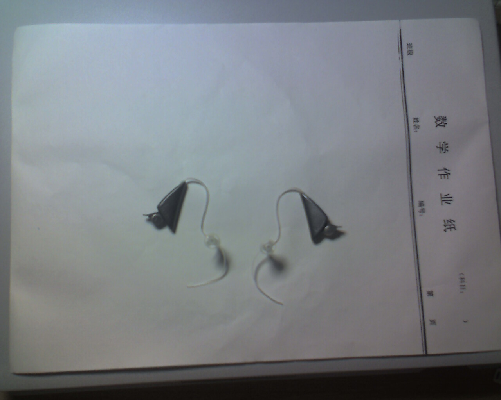

看看它有多小:

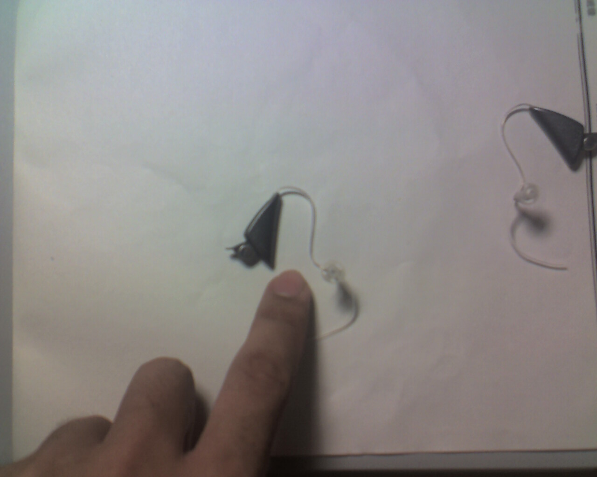

这机器确实很精致，就像艺术品。但手机拍不清楚，上一张奥迪康官网上的图片：

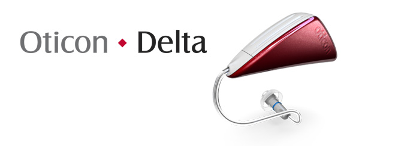

精致的盒子:

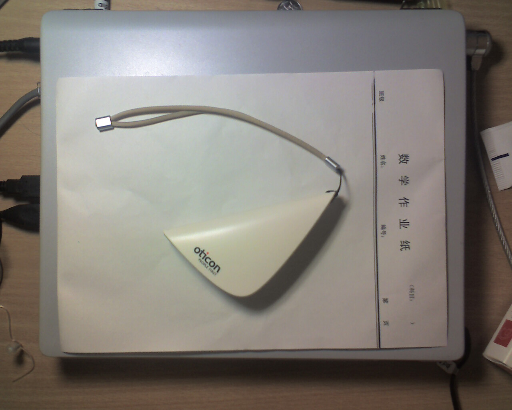

放两只助听器刚好

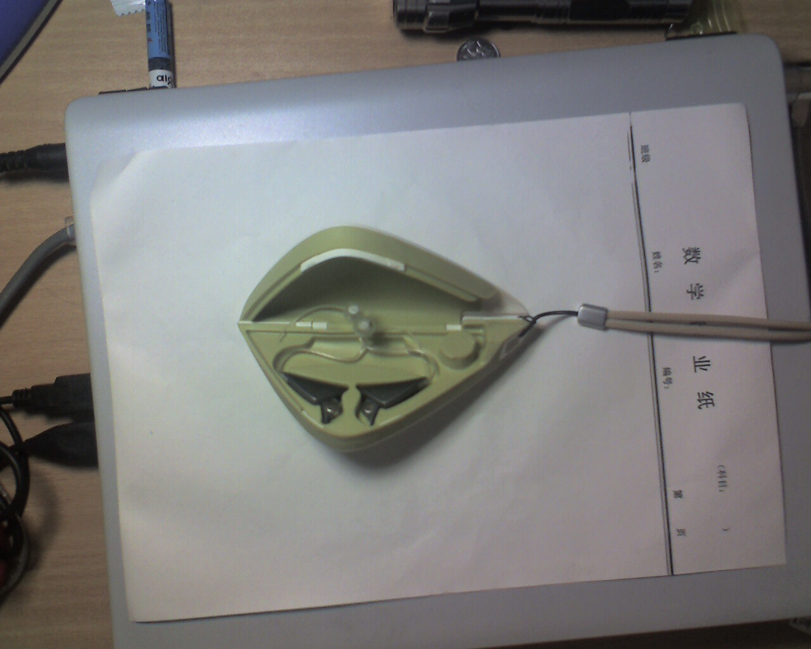

外包装:

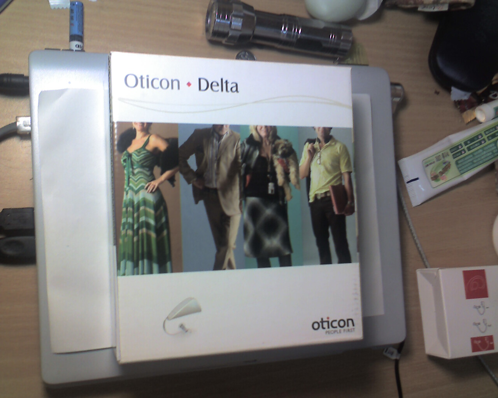

里面还有一个皮盒:

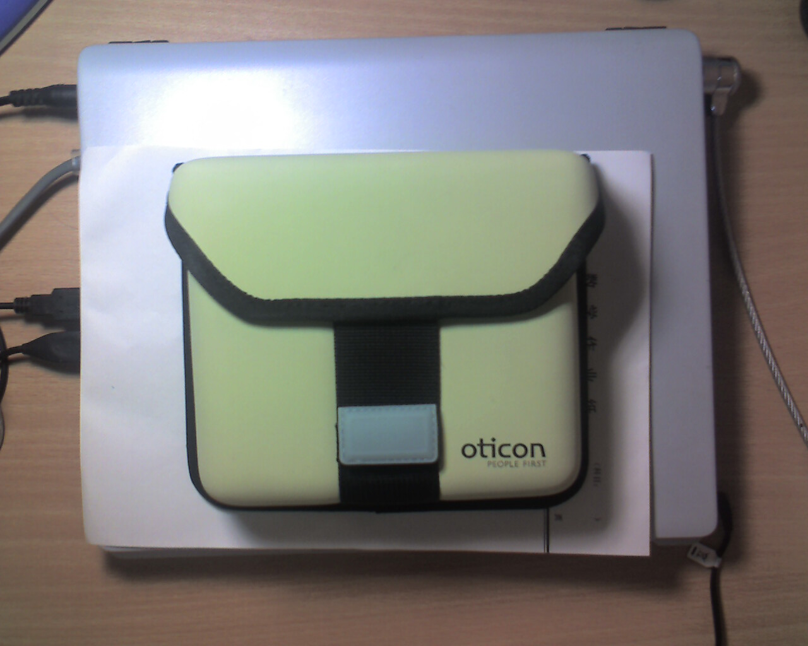

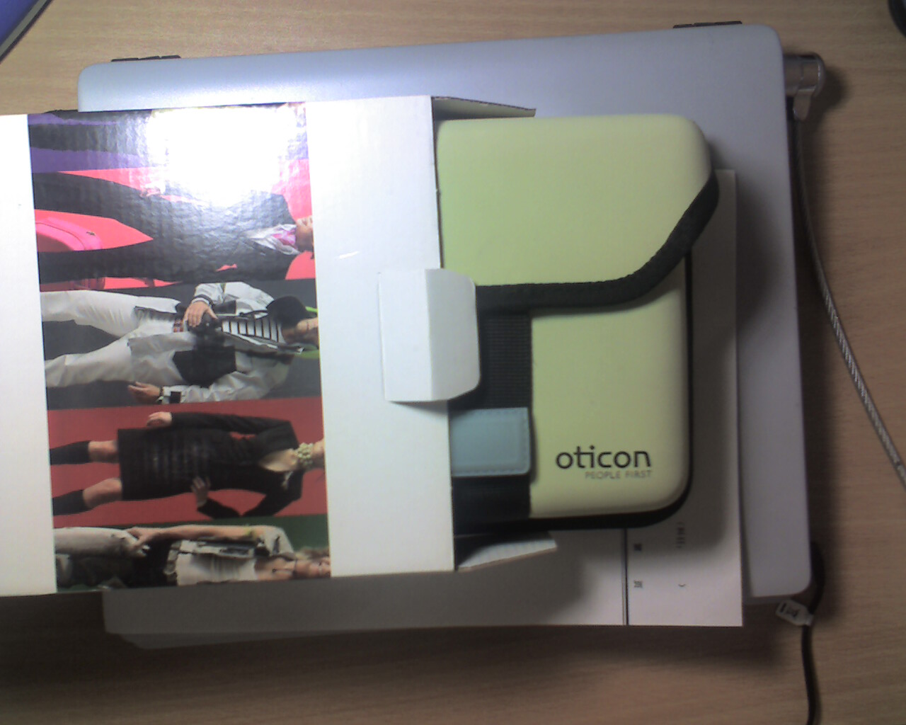

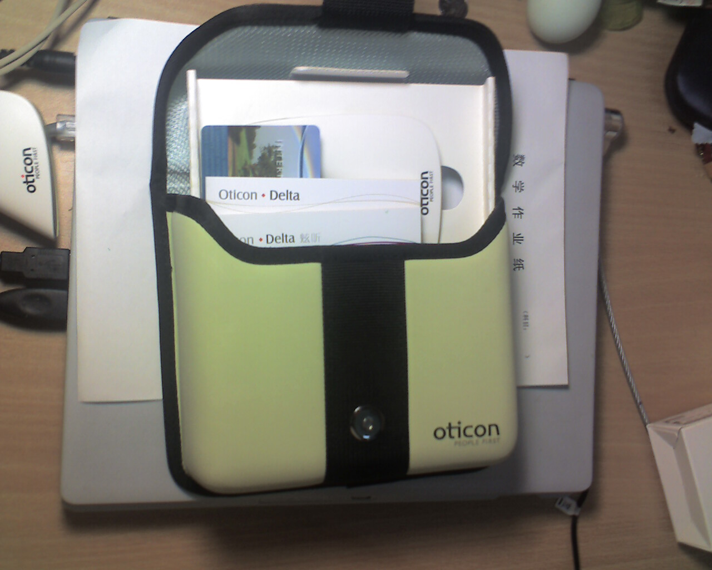

里面有一大一小两只盒子. 大的是硬盒, 小的是软盒.

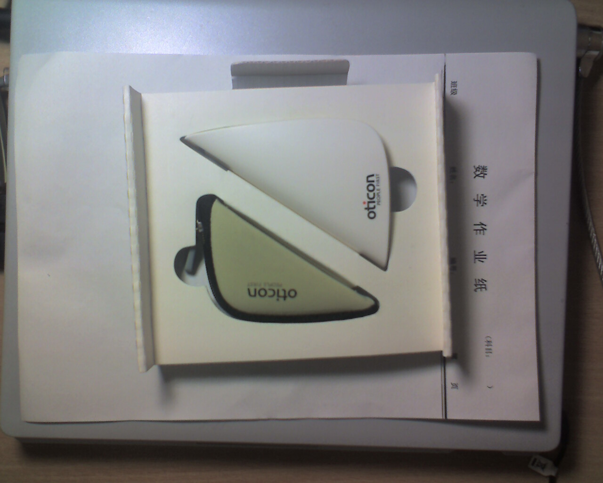

中英文使用说明, 全球联保卡(但是在国内保修不用这张卡, 用另外一张)

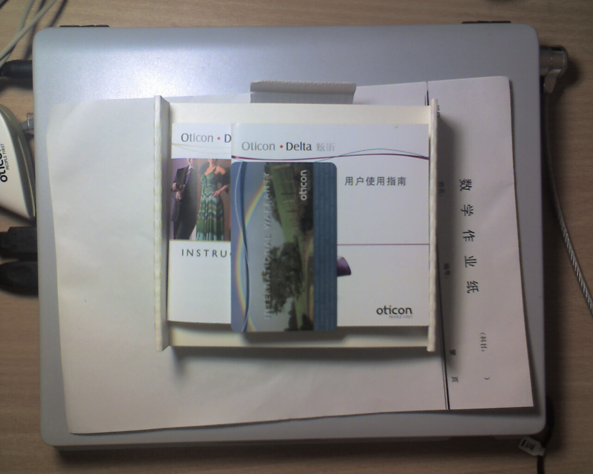

受话器包装：

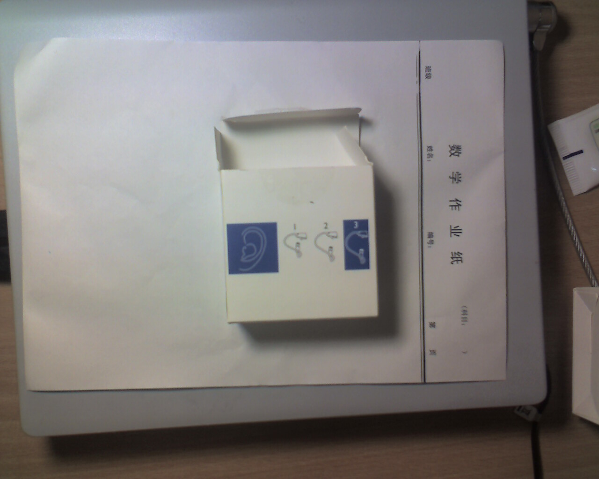

装受话器的小盒：

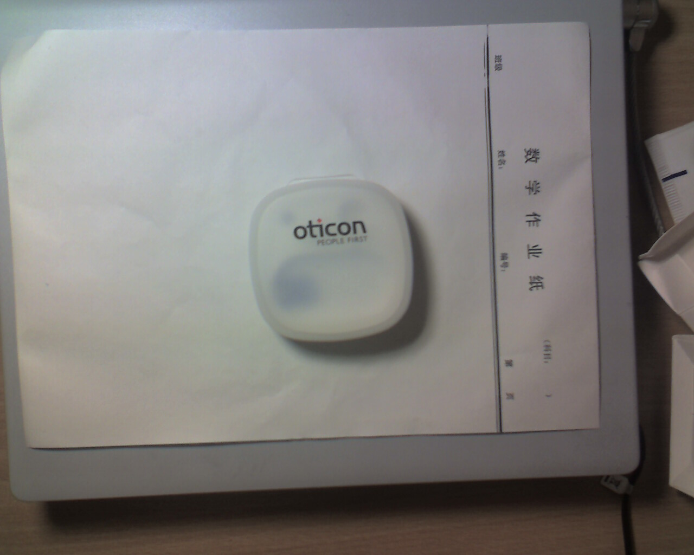

7月9日拿到的助听器。验配师非常好，调试完之后，还送了很多东西。然后约两天之后再来继续调试。

在店里的时候，听什么都感觉蛮清楚的，也没有什么不舒服的感觉，就告辞回去慢慢感受。上马路的时候，可能音量开得比试模拟机的时候大了些，感觉比原先吵了点，但还是可以接受。汽车的喇叭也没有觉得刺耳。那天地铁的广播声音很大，（确实是那天特别大，其它时候没有那么大，我妈也说是这样），觉得有点震的慌，就摘了。

下地铁之后又带上，去一个饭馆吃饭。饭馆里人不是很多，也就三四桌的样子，但是还是觉得有点吵，（当然不是说像大街上那样吵，只是觉得不安静而已）。吃完饭上公交车，天气很热，又堵车，车窗玻璃震得哗哗响，觉得公交车简直不是人呆的地方。

回到学校，第一个感觉就是学校里鸟真多啊！不管走到什么地方都有鸟叫。满心充满喜悦。以前并没有觉得乌鸦叫得难听，而现在发现，这家伙的大嗓门还真是不好听。水龙头的水声确实大了很多，但是觉得很好听。当然，新听到的也不全是美好的声音，比如鞋子蹭地的嘶啦声，就不大让人喜欢。

平时觉得很安静的校园，现在哪里都有声音，自行车声，脚步声，风声......只有宿舍还算安静。晚上去散步，草坪上有人在吹拉弹唱，湖边处处虫鸣，简直找不到一块安静的地方了。

第二天也许是适应了点，觉得前一天不适应的许多东西都可以接受了。公交车不再觉得不是人呆的地方，晚上的湖边的虫鸣也觉得不那么令人惊奇了。但这次觉得受不了的，是医院收费处点钞机的声音。助听器戴的时间一长，就觉得声音毕竟还是有点机械的感觉，不是太自然。而当初觉得奥迪康的机子声音很自然，可能是试的时间不长吧。某个同学的声音可能比较特殊，聊天时听起来机械感尤为严重。晚饭在一个很吵的饭馆吃饭，比肯德基还吵。觉得环境的嗓声大得不能忍受，戴助听器听人说话并未觉得比不戴要好多少，最后还是摘了。

晚上用电脑听一点东西。笔记本的扬声器比较烂，就我听的感觉，似乎峰值在4K赫兹左右。低于600赫兹的声音，这喇叭一点声也不出。以前从不用扬声器的，因为根本就听不见它那么一点声音。听语音，能听见但完全听不清，听交响乐，音量开小了声音小的时候听不见，音量开大了声音大的时候就破音。但是现在试助听器又不能用耳机，只好用它了。

助听器的放大效果不错，从音量上说，完全可以像正常人一样听笔记本扬声器了。听语音的效果还凑合。但刚放音乐的时候，我吓了一跳，这是什么东西嘛！完全就是噪音啊！交响乐是完全不能忍，一点调子也没有；声乐也不行，浑厚的男声给弄得都快成女声了。后来觉得可能未必是助听器的问题，可能那扬声器就是太破了。等回头买了音箱再说吧。

去学校的自习室感受了一下，虽然听到了许多原先听不到的噪音，但是对自习室还是挺习惯的，可以安心学习。

骑车感受了一下，完全没有风啸声。不知道是Delta外形小巧，完全隐于耳后了，还是因为风啸声主要是低频，开放耳的设计没有给予放大呢？平常戴耳机听音乐的时候，风啸声就常常大到听不见音乐的地步，我觉得可能还是Delta的外形好，整个都被耳廓挡住了吧。

Delta的抗啸叫功能也是不错的。动态抗啸叫。用手笼在耳后，可以听得见啸叫，但一般一秒之内就会消失。手移动一点，啸叫又出来了，但小一点，被消去得也更快。这点让我觉得它可能是用移相的方法来消除声反馈的。安静的时候，有的时候可以听见一点轻微的啸叫，但重复刚才的位置，却不能重复啸叫。

汽车的喇叭声感觉不刺耳，不知道是不是瞬噪消除功能的功劳，但是电动自行车的喇叭声还是很大，总是吓人不轻。

12日去助听器店，验配师说可能我刚配助听器，对高频补偿有些不习惯，但无论是从我的听力图来算增益，还是从配过后做的声场测试结果，高频补的都不算多（声场测试中，将将能到30分贝）。于是给我把高频降了3分贝，让我适应一段时间后再回他那里调回去。这次就觉得声音舒服多了，但当然识别率也下降了一点。

先写这么多吧，等有了更多的体验之后，我再陆续补上。
