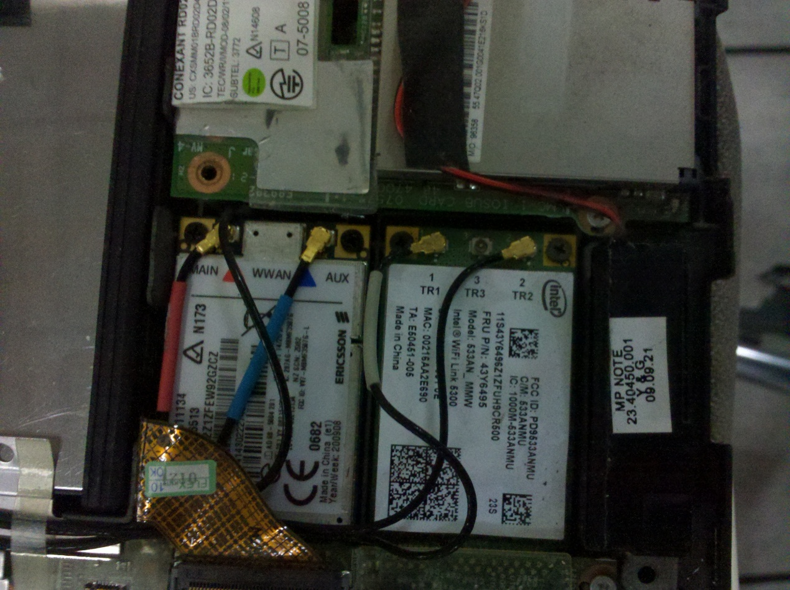

淘宝上搞了一个 Ericsson F3507g，于是我的小黑现在有 WCDMA 和 GPS 支持了

开门见山，对于同样使用 F3507G 正在寻求解决方案的同学，本文可能冗长，包含的最有用的信息均已总结在文章末尾，可以直接跳到倒数第二段。

拿到之后，立刻动手开拆。之前已经打印了一份 X200 Hardware Maintenance Manual 备查。

轻车熟路地拆去键盘、掌托，便露出 mini PCIE 插槽。很久没拆开，已经落满灰。小心吹了吹灰，插上数据卡，拧上螺丝，插上天线。

合上掌托，插 SIM 卡，装电池开机，居然找不到硬件！安装驱动程序，依然找不到。大囧。于是问店家，建议重置 BIOS 试试。虽然在 BIOS 里一点都没找到关于 WWAN 的选项（仅有一个 WLAN 和 WiMaX 的选项），但重置 BIOS 之后再开机，神奇地出现了找到新硬件。

安装 ThinkVantage GPS Enabler，上窗口试了一下，能搜到星。升级 Access Connection，能正常连接联通 WCDMA，信号很好，速度快，便心满心足地睡觉去了。（唯一不好的是流量跑得太快了！！！！）

第二天，开始折腾如何收发短信——真是漫长的历程。

首先查看 Access Connection，竟然没有收发短信的选项。网上网友说，据传说 5.02 版是可以收发短信的，而我的 Access Connection 是 5.95 最新版。总不要为这个把我的 Access Connection 降级吧？鬼知道降级之后会不会和 Hotkey 之类的程序冲突。而 Access Connection 的 Help 里面明明白白地说：不支持对 F3507G 收发短信。

OK，那就另想办法吧。没有短信还是很糟糕的——毕竟流量花了多少，Access Connection 说的不算，联通下发的短信才算数。

网上有人说，可以安装 Ericsson 的 Ericsson Wireless Manager，即可使用短信功能，而且比 Access Connection 功能强大得多——至少 GPS 地图是 Google Maps 而不是坑爹的 Bing Maps。但据网友说，Ericsson Wireless Manager 是不能和 Access Connection 共存的，必须卸载载 Access Connection 才能使用 Ericsson Wireless Manager，否则 Ericsson Wireless Manager 无法找到 WWAN 卡。而且 Ericsson Wireless Manager 也有 Bug，比如说，如果关闭了它，就会自动给 WWAN 硬件断电——直到下次开机才能重新使用 WWAN，而且 ThinkPad 的 Fn+F5 控制将无效。那这也太坑爹了吧？

不过又有网友声称，他发现了一个完美的共存办法：使用 Access Connection 调用 Ericsson Wireless Manager。只需要在 Access Connection 的概要文件里设置，不使用 Access Connection 本身来连接网络，而使用其它程序连接网络即可。由 Access Connection 调用 Ericsson Wireless Manager 时，Ericsson Wireless Manager 将可以找到 WWAN 卡。而 Access Connection 仍然可以照常 Fn+F5 打开和关闭 WWAN 卡电源。

看上去不错，于是去找 Ericsson Wireless Manager 的下载。糟糕的是，原始地址是 sonyericsson.com，而我们都知道，这家公司现在已经改名叫 Sony Mobile 了——于是在 sonymobile.com 上根本找不到此软件的下载。

最后去其它网站找到了这软件。装上之后，一连串悲剧开始了……

有 Access Connection 的情况下 Ericsson Wireless Manager 当然找不到网卡，这已经是公认的结论。在 Access Connection 里尝试调用 Ericsson Wireless Manager 来连接网络，可是 Ericsson Wireless Manager 还是报告找不到网卡。更糟糕的是，Access Connection 现在也无法控制网卡了，总是报告：其它客户端程序正在使用 WWAN 卡……于是竟然怎么都没法上网了！

卸载 Ericsson Wireless Manager，问题依旧。卸载 Access Connection，卸载 F3507G 驱动，再重装驱动和 Access Connection，Access Connection 仍然死活无法控制 WWAN 卡。反反复复尝试用各种顺序卸载重装了包括 hotkey、Access Connection、驱动、GPS 在内的各种软件，结果不仅 Access Connection 无法找到 WWAN 卡，连 Fn+F5 里也显示不出 WWAN 了。甚至一度连 WLAN 图标和 Access Connection 中的其它概要文件都挂掉，各种诡异问题。

（之前网上还有网友声称 Ericsson Wireless Manager 是准绿色软件，无须安装直接拷贝即可使用。你妹的绿色软件！）

在彻底卸了所有能找到的相关软件并重装后还是不行，于是我一怒之下——系统还原了。

系统还原之后，终于一切正常了……不过仔细看了一下，这次提示找到新硬件并安装驱动程序的界面明显和之前不一样：之前每次重装驱动程序，都只提示为两个硬件找到了驱动程序；而现在是提示为六七个硬件安装了驱动程序。

所以目前我认为：Ericsson Wireless Manager 显然留了一些设置没卸载干净，导致其它程序无法使用 WWAN。同时，Ericsson 的驱动也很糟糕，也没有卸载干净。

于是继续尝试别的办法收发短信。

先装了一个 ThinkPad Lenovo Mobile Broadband （旧版叫 ThinkPad Lenovo Mobile Broadband Connect），据说可以用于收发短信。装了之后发现，它主要用途是向移动运营商激活 WWAN 卡。也许是在米帝的一些 TP 机型是包含运营商套餐的吧。支持 AT&T 和 Verizon，不支持大陆的任何运营商。于是卸掉。

接着，在 lenovo GB 网站上搜索 Ericsson，竟然找到了一个看起来像有用的东西：

<http://support.lenovo.com/en_GB/downloads/detail.page?DocID=DS008212>

Ericsson Mobile Broadband Manager

试着装上去之后，果然能用这个软件收发短信了！

但是在 ThinkVantage GPS 的说明页面，提示 ThinkVantage GPS 与 Ericsson Mobile Broadband Manager 不兼容，可能会导致报错，不过目前我还没有遇到过问题。

 

对于同样使用 F3507G 正在寻求解决方案的同学，本文包含的信息如下：

- Access Connection 无法收发短信
- 收短信可以使用 Ericsson Mobile Broadband Manager（Lenovo US 网站下载），据官网说法和 ThinkVantage GPS 有冲突，但我没遇到。
- Access Connection 与 Ericsson Wireless Manager 不兼容。同时安装会导致两者都不能使用且很难恢复。所以一定不要重复安装！（可能和我使用的版本有关，版本见下）
- Lenovo Mobile Broadband (Connect) 在中国大陆没有用处。

本人使用的软硬件版本（所有软件均已更新到能找到的最新版本，有些比 ThinkVantage System Update 提供的还新）：

- ThinkPad X200 
- BIOS 3.21.1.06 
- Windows 7 Ultimate SP1 X64 OEM 
- Ericsson F3507g Wireless WAN Windows 7 驱动程序 6.3.3.6 
- ThinkVantage Access Connection 5.95 
- ThinkVantage GPS 2.80 
- Hotkey 3.80 
- Ericsson Mobile Broadband Manager 版本 CXP 901 4396/21（6.1.6.2）

下面两个东西没有用，但也许只是我用的版本不对

- Ericsson Wireless Manager 5.3.2076.12 （不能用！）
- ThinkPad Lenovo Mobile Broadband (Connect) 3.5.0011 （没用）（X200 最新只能用 3.5，X201 以上可以用 4.1）
