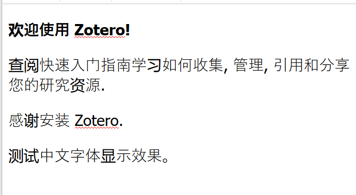
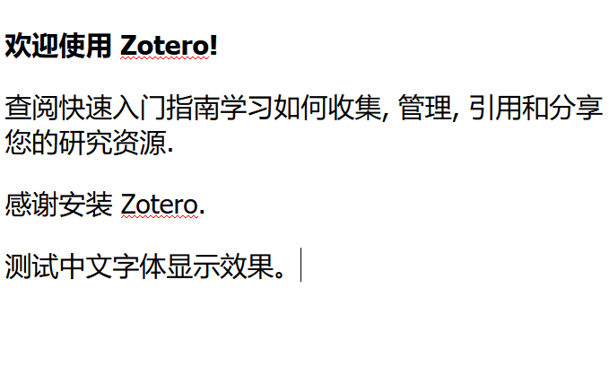
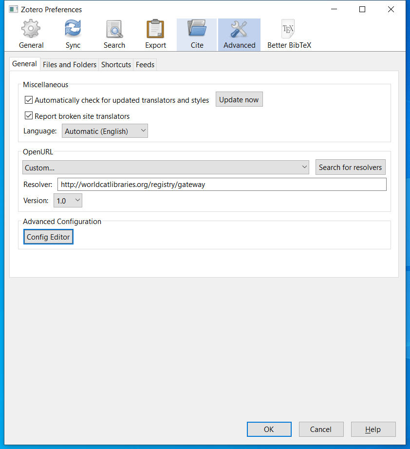
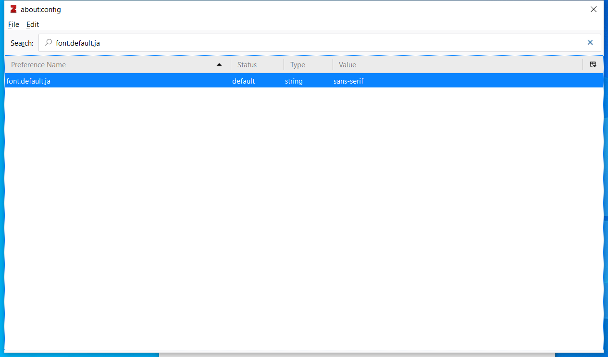
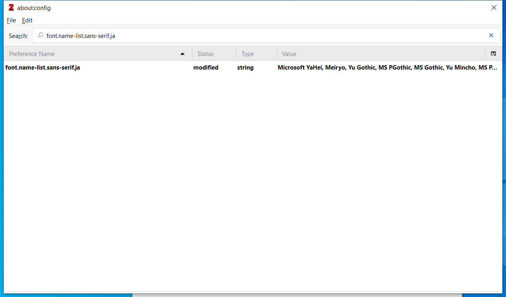

本文最后更新于 2020年4月28日

# 问题概述

当 Zotero 使用英文界面时，中文字体显示可能会出现异常，表现为大小粗细不一。此问题目前网上没有解答，我是第一个给出解答的人。

问题主要出现在英文操作系统下。但在中文系统下，如果用户不愿意使用中文界面而使用英文界面（这可以通过禁用 Zotero 的 intl.locale.matchOS 选项实现），也可能受到此问题的困扰。

问题表现如下图所示，Zotero 默认安装后，显示中文时出现了不同字体混搭，显示效果非常怪异。

经过下文所介绍的设置之后，问题得到解决，效果如下图

# 原因

操作系统中没有语言 fallback 顺序的设定。于是 zotero 使用软件自己的 fallback 顺序。先尝试英文，英文无法显示再 fallback 到其它语言。因其它语言的 fallback 顺序未设置，故为未定义行为。而默认顺序日文 ja 排序在中文 zh 之前，先落到日文字体上，无法显示的再落到中文字体。这样一行文字当中，有的字（大多为繁体字）使用日文字体显示，有的使用中文字体显示，造成了一行字体不一致。

详细的原因分析见文末讨论部分。

# 解决办法

## 2017年7月之后的解决办法

很遗憾的是，由于 Zotero 的更新，原来的较优美的解法（令中文优先于日文）已经不能使用。详见文末讨论部分。

暂时的简便解法是这样的，既然知道问题出在 Zotero 调用日文字体来渲染中文，那么我们把默认日文字体改掉就好了。

进入 Zotero 高级选项：Tools-Preferences-Advanced-Config Editor

搜索 font.default.ja，它的默认值应该是 sans-serif。

因而我们需要改掉日本默认的 sans-serif 字体。继续搜索 font.name-list.sans-serif.ja，然后将一个你喜欢的中文字体放在那一堆日文字体前面即可。我这里用的是微软雅黑。设置会立刻生效。

这种解法的缺点是日文文献可能会有显示问题，但是中文字体的汉字加上日文字体的假名，倒也不算特别不协调。实在在意的话，可以使用 Arial Unicode MS 之类的兼容中日两国所有字符的字体。

强迫症可以参考文末讨论部分的另一种不完美解法。

## 2017年7月之前的解决办法

如果使用老版 Zotero 且一直没有更新的话，仍然可以用下面这种方法，使中文优先于日文。

进入 Zotero 高级选项：Tools-Preferences-Advanced-open about:config

搜索 intl.accept_languages，其默认值为 en-US, en。加入zh-CN，重启即可让简体中文落在日文之前，问题解决。

如果想让中文字体也用于显示英文字符，则应该把 zh-CN 放在最前面。但一般情况下中文字体的英文部分都不好看，还是保持 en-US 在最前面好了。

# 讨论

Zotero 使用 Firefox 渲染引擎，这些选项实际是 Firefox 的设置。intl.accept_languages 选项正是 Firefox 用于设置网页语言 fallback 顺序的选项（Firefox 中对该选项的说明是“Choose your preferred language for displaying pages”）。所以，早先设置这个选项即可使 Zotero 优先使用中文字体显示汉字。

2017年7月之后，Zotero 的一次更新屏蔽掉了该选项对 Zotero 的作用。对此问题，我已经向 Zotero 反馈，但 Zotero 开发者表示无意修正此问题。详见  
<https://forums.zotero.org/discussion/75996/intl-accept-language-setting-no-longer-works>

以上链接中，Zotero 开发者给出了 Firefox 源码中的相关部分，并建议有能力的人自行编译 Zotero。由 Firefox 源码可见，Firefox 默认的 CJK 字体 fallback 顺序是日中港台韩，看来是按国际影响力，而不是字母顺序排序的。不得不承认，日语和其它语言的交流比汉语要密切得多。

如果读者有强迫症，不但要解决中文显示问题，还要求中英文字体也要一致，那么下面讨论两种办法。

除了上文所举的两种修正中文字体的方法之外，还有一个选项 extensions.zotero.note.fontFamily，可以控制 Zotero 中 notes 的显示字体。但这个选项无法解决 Zotero 条目列表中的字体显示问题，只能改掉笔记的显示，所以只能算一种不完美解法。

如果是在2017年7月之前，当然可以用第二种方法让中文字体来显示英文，算是比较完美的解法。在2017年7月之后，如果希望 Zotero 里所有中英文全部用一种字体显示，就没有特别方便的办法了。前文建议读者设置日文字体来解决汉字显示问题——如果要中英文字体一致的话，那就还需要再设置一下 Latin 字体（这里没有英文设置，只有西文设置）。这样的话需要动两处设置，略麻烦。

最后说说字体选择——如果读者有所有文本一律用一种字体显示的强迫症的话。对于只有中英文的情况，一般的中文字体足敷使用。如果还有它国语言文字，如前所述，可以使用 Arial Unicode MS 这样的 Unicode 字体。Unicode 字体的选择并不是很多，现在有一个新选项是 Adobe 的思源黑体，去 Google 官网下载 Noto Sans CJK SC 即可。对于中国大陆读者，推荐下载末尾为 SC 的版本，否则对于同一个字的不同字形将使用港台日字形，未免令大陆人士看起来不大舒服。
