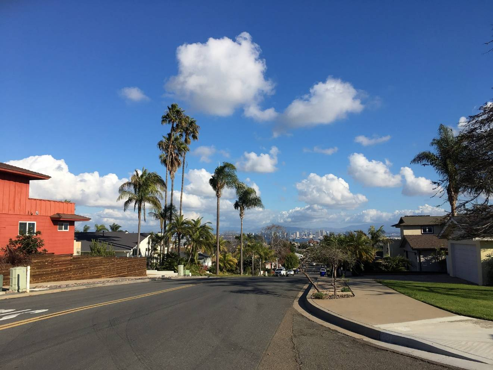

Last updated on Apr 30 2020

本文原来是购买 GX85 之后的 [感想](https://blog.wangxuan.name/2018/12/14/why-do-i-need-new-camera/) 的一部分。现单独拆成一篇并修订，以便每年不断更新我和照相这件事的故事。

「拍娃」和「谈恋爱」这两件事，过去是，现在是，大概将来仍然会是人们购买相机的重要动力——如果将来还有相机这种东西的话。那时还说得过去的中国城市家庭，几乎都会有一本影集。我家也不例外：父母的约会、我小时候的蠢样，都在其中。除去某些重大场合是借单位相机或者请照相馆拍的以外，那相册中的照片基本都是一部日本产的胶卷「傻瓜相机」拍出来的。父亲对于那部相机甚为宝惜，直到这台相机封存之日，仍然连纸盒包装在内的一切都崭崭新。现在看来，那种傻瓜相机，几乎没有任何可调节选项，曝光控制中唯一自动化的部分只有测光，只是靠大景深来实现随手可拍，当然是比不上现在的任何一种照相设备了。然而那时廉价的「傻瓜相机」承载了中国无数家庭的记忆。一卷 36 张的胶卷，在工资只有三百块的年代，也是很昂贵的耗材了。在使用那部傻瓜机的时候，父亲每次买胶卷都必买柯尼卡，按他的说法，虽然最贵，但是最好。当然这在摄影发烧友的眼中不算什么了，不过对于平素非常节俭的父亲来说，在那个物质还比较不充足的年代，是他为数不多的对于品质的追求。那台傻瓜相机因为是家里贵重的财产，默认我是不应该去碰它的。唯一一次因为好奇打开的结果，是使几乎一卷胶卷报废，其中包括父亲和单位朋友一次旅途的几乎所有照片。父亲为此很不开心，不知道该怎么和朋友们交待。

下图为那台相机所拍的郊游野餐

我父亲对摄影的兴趣从童年一直持续到他最后的日子。小时候玩暗室技术，后来则是 PS 高手。一向将老一辈人勤俭持家风格发扬到极致的他，在买数码相机这件事上，反而出乎意料地完全没有反对母亲的提议。于是，2002 年，我家并不算晚地踏入了数字影像时代。这部数码相机被我父亲用了十年之久，算是他对勤俭风格的坚持。它虽只是一部两百万像素的尼康低端消费级相机 [E3100](https://www.dpreview.com/reviews/nikoncp3100)，画质比不上现今的主流手机，相对于前一部相机的进步无疑是巨大的。有了真正可以对焦和变焦的镜头，还有即时预览图像的液晶显示屏，而不再需要冲洗完成之后才能知道拍照是否成功，更不用说插上 64MB 的 CF 卡之后可以存储胶卷时代不敢梦想的 200 张照片。得益于小底易于实现微距，第一次体验微距拍摄的时候全家人无比惊奇于那纤毫毕现的细节。极轻极小，虽然没有调节选项，但全自动设置往往已经够用。家里人无论去哪里几乎总会带上这部相机。在那个经济迅速腾飞，家庭收入开始增长的年代，它记录了家里无数的第一次：第一次自费出门旅游、第一次坐飞机、第一次坐动车……

下图是这部相机所拍的三亚旅游照片

不久，父亲又买了打印机和扫描仪。家里全部的老照片也被扫描进电脑。胶卷时代自此结束。那台父亲无比爱护的傻瓜相机留给我之后，我也没有用过一次。反正要拍照的时候，只要认真保证不会弄坏相机，总是可以把家里的数码相机借出来的。

下图是高中时运动会时用它拍的照片。正在跳高的是我的好朋友。

07 年去北京上学，从此一年到头没几天在家。我的第一部手机是摩托的 E2，带有一个与傻瓜相机原理约略相同的 130 万像素摄像头。超焦距成像，CCD 自动测光，电子快门，可调节的选项为零。进入相机程序也颇麻烦。不过那时我已经很感幸福，毕竟它的画质已经好于我家那个古老的胶卷傻瓜相机，兼有数码成像的方便。拥有父辈和我同样年龄时不敢想的设备，对于捕捉大学期间的各种新鲜事情来说，那是非常足够了。虽然没有任何选项，但摩托的直出调教非常讨喜，颜色饱满鲜艳，也不容易过曝。刚进大学什么都新鲜，无论是校园各处的风景，还是海报、课程表，一概都拍了下来。出去游玩的时候它的重要性更不必说。（我现在舍友的大头照，还是那年秋天野外观测时拍下来的。谁能想到这就是十年的友情呢？）

后来我最喜欢的手机三星 I780 的后置摄像头反而倒退一步，无论低光照场景还是颜色调教都比不上摩托罗拉，前置摄像头也只是聊胜于无。想十全十美是很难的。而那时摄像头最好的手机大概是诺基亚的 N97，外型够帅，镜头很大，滑盖露出摄像头，死党手里就有一个。然而即使 S60 系统并不会像早期 Android 一样卡顿，这个机器的快门延迟也达一秒以上。总体来说，虽然我 2011 年本科毕业时消费级卡片机的市场已经被手机打击得相当厉害，以那时手机蹩脚的拍照性能，那时候如果谁说手机拍照会满足绝大部分的拍摄需要，大概任何一个摸过中端相机的人都不会相信。

索性在这里把所有手机的故事都讲了吧。研一时的 HTC ChaCha 是第一台有自动对焦可以扫二维码的手机可惜没两天就丢了。之后的里程碑 2 又回到了熟悉的摩托罗拉，还是一样舒服的颜色曲线调教而摄像头更加强大，甚至还有实体两段快门按键。不过快门延迟的问题直到我后面的两部手机还是没有解决，Lumia 638/640 都是几百块的廉价机型不能要求太多。16 年换 iPhone SE 之后才终于体会到了手机摄像头技术进步的福利，即指即拍和很低的快门延迟虽然不能和微单、单反比，但大部分场合已经完全够用。苹果的直出调教是一向的优秀省心。

下面三张照片分别是 Moto ME722，Nokia Lumia 638，iPhone SE 拍摄的。可见最后一张相对于前两张画质的飞跃式进步。

说回相机吧，那是我花了更多心血的地方。

2010 年，我还有一年毕业。我想记录下校园一整年的变化，留作永远的回忆。于是我战战兢兢地向父亲打报告要求买相机的经费。其实还出乎意料地顺利，只是父亲十分精准地预言了将来的发展「我怕你将来没多久就要换更好的相机」。但当时我对自己继承勤俭家风相当自信，而且不愿意继承那台已经用了近十年的尼康小 DC 凑合一下「以待将来一步到位」，打包票说做了十足的购机调查，至少能用个五年。在巨细靡遗的调查（甚至包括了对所有[电池技术的详细调研](https://blog.wangxuan.name/2011/03/06/choose-the-right-battery/)）之后，我选择了一个看起来不算贵，对于摄影入门该有的功能似乎也有的机器：[富士 S1770](https://www.dpreview.com/products/fujifilm/compacts/fujifilm_s1600)，大概一千二三百到手。不论那台机器的参数现在看起来如何的寒酸[^1]，但摄影技术的大门终于向我打开了。

纵然这台机器有着无数的坑，好歹是自己选的，理论上有 PSAM 档（虽然由于光圈形同虚设，意思并不大），可以试验各种曝光参数，直方图预览也颇方便。从图书馆搬回来一摞一摞的摄影书来学习基本摄影概念，得到舍友的评价：「你适合搞科研」。打开新世界之后创作热情迅速迸发，公交车外移行闪烁的霓虹灯、多次闪光拍下上铺兄弟的四个身位、用那糟糕镜头做的虚化尝试……难以想象当时竟然试验了那么多有趣的东西。快门光圈景深焦距，各种曝光要素的基础知识就是从下决心买这台相机开始熟悉的。大四时华北、江南等各地出游和班级毕业旅行的记录都是用它拍下的。和某前任的大部分照片也是它拍下的。所以直到现在，我还能回忆起那台相机握在手里的手感，满满的都是回忆。

下面三张照片都是用它直出的。前两张展示了一下它仅有的优点：超长焦距。

然而用得越久，S1770 性能上的局限越让我挠头。不用想星空夜景，也不用想抓拍。高感、快门、延迟上的痛点让出门旅行都不能拍个痛快。新手机里程碑 2 的出片效果之好让我更想摔相机。2014 年，终于抓住机会用一千五百块的价格拿下了松下 GF5，我的第一台真正意义上有丰富可调节参数的可换镜头相机[^2]。现在看来，这个价格简直不可思议，也是当年市场形势使然。

新机拿到手里，大气不敢出地装上镜头，按下快门的那一瞬间，手上机械快门传来的震动就使人心潮涌动。快门震动感、旋转变焦环和对焦环时的手感，让人一下子就明白为什么那么多人迷恋胶卷时代单反相机的手感——那种把握住手中机械的掌控感，大约和开手动档汽车的乐趣是相通的。

作为穷人，没钱买镜头。彼时松下最便宜的 25 1.7 还没有上市，20 神饼虽然风靡一时二手也要至少一千两百块。看着各种镜头垂涎，甚至开始打起了转接手动头的主意。终于还是悬崖勒马没有走上这条烧器材的不归路。自带的 14-42 套头虽然光圈小画质一般，但是基本覆盖常用焦段，对焦迅速，有防抖，在各家的套装狗头中完全不落下风。

穷人烧不起器材，但还是可以进一步学习提高摄影技术。认真读完了《纽摄》[^3]，进一步了解了用光和透视。时而用强光手电进行补光，买了三脚架来实验各种长曝光效果。

那时候正值硕士毕业，第一轮申请悲剧掉了，毕业的压力和异国恋的压力都颇大，同实验室师兄弟在那段时间一起互相支持。相机记录下了在生物物理所的日子里师兄弟们的快乐时光。飞往美国的旅途，在 Bloomington 的最初印象，都靠它记录下来那些记忆。和某前任的最后几次见面，在国内和美国的几次出游，也带上了它。可惜的是和她分手之后心灰意懒，不想出门，这台相机只被我经常使用了两年时间就开始吃灰。一来出门很少，二来手机拍照足够便利，带上相机背大包在博物馆往往还需要存包。甚至在回国的时候也没有带上（根据以前的经验，带上也不会用的），和父亲最后的合影都是 iPhone 留下的。父亲故去之后，母亲来美国探望我的时候，本来想买个新相机，还是作罢，于是 18 年和母亲出游的照片也是它留下的。不过，因为它小巧方便，后来有了 GX85 之后，出游的时候还是经常带着它，两机各带一镜头，免去了换镜头的烦恼。

GX85 的购买动机在本文原来所属的[那篇文章](https://blog.wangxuan.name/2018/12/14/why-do-i-need-new-camera/)里交待了一下——我期待这是一个让我「重新发现生活的美好，重拾进取的热情」的契机。购入之后，也确实达到了预想的目的。初次带着它独自去 San Diego 散心，一扫失恋的阴霾，这次漫无目标不做打卡预期的旅行也似乎让我找到了最喜欢的旅行方式。另一次同样无组织无计划的旅行中，在马尔马拉海上目睹太阳在君士坦丁堡老城落下，成为永恒的记忆。2019 一年所拍下的照片超过之前数年之和。

GX85 的硬件相对于 GF5 无论是操控还是功能上都有所进步[^4]。19 年用它折腾了不少有趣的延时摄影。因为有热靴，用闪光灯拍出各种有趣的照片也提上了日程。希望 2020 年能有闲暇和热情把许多计划完成。

# 外一篇——父亲的摄影故事

原本散见于本文的脚注，现集结在一起。或许会继续修订扩充。主要是对先父的追忆流水帐，读者未必会感兴趣。

我父亲对摄影的接触比我早多了。当我父亲还在中小学的时候，就和我大伯兄弟俩借出我爷爷奶奶单位里的 120 双反相机出来拍照——那种完全没有自动测光对焦的机械相机，想拍出能看的照片是非得明白照相机的工作原理不可的。拍出照片之后，还需自行去暗室显影定影冲洗照片。不过放大机和彩色照片还是过于高级的东西，一般的孩子无缘上手。

汤姆牌傻瓜相机的故事在本篇中已经讲过。我家的第一台数码相机，那台两千块的尼康小 DC 被父亲一直用到塑料老化，电池卡扣断裂，还用橡皮筋捆起来继续用。

大约我高中的时候，买第一台数码相机四五年之后，他又买了家里第一台 DV。那台 DV 还是使用磁带录像的，导出到电脑里时需要使用视频采集卡。他用那部 DV 剪辑了几段视频，花了不少心血。

当然磁带是太不方便了，在存储卡 DV 成为主流之后，又有了一部新的 DV。虽然像素不如尼康小 DC 高，但是毕竟没有损坏的零件，所以第一台数码相机就这样吃灰了。

在我买了第二台相机 GF5 之后不久，他终于下定决心淘汰掉那台尼康 DC。问了一下我的意见之后，买了尼康新出的小卡片。综合来看是比我的第一台相机强多了。

不久因为记录游泳的需求，又买了一台索尼的防水卡片机。因为机身实在是小巧轻量，前一台尼康即使有更好的画质也还是吃灰了。所以想想的话，我离家之后，他自己的生活还是有很多乐趣的，这让我回忆起来的时候很感欣慰。

不过因为他在手机上始终比较吝啬，一直没有享受过高画质手机摄影的便利。不过他走了之后，我在电脑里找到了许多手机自拍的鬼脸，也算是赶上了末班车。

PS 是另一个故事了，本就有绘画功底，透视用光构图都有相当基础，P 出的图片可以以假乱真。他很享受这其中创作的乐趣。改日会把他的作品发上来。

[^1]: 说起来呢，那台机器也真是够寒酸的。不然也不会到 2014 年的时候我迅速食言趁着双十一买了我的第二台相机。堪比手机的一秒多的快门延迟，只有两档的形同虚设的 ND 滤镜光圈，号称机身防抖但完全扛不住这机器长焦端 420mm 等效焦距，ISO400 就是可用极限，涂抹成油画一般的降噪风格，没有任何拨轮的操纵非常不方便。

      虽然前面吐槽那么惨，但是还是有优点的。宽大舒适的握把，富士的色彩调教，CCD 的全局电子快门，加上电池不过 440g 的重量，外加我的独脚架，携带起来比后来的微单还要轻巧。白饶的 EVF 虽然分辨率惨淡，在光线强烈时的确是不可或缺。

[^2]: 这套机器相对于前一台的提升无疑是巨大的。有丰富完整的光圈快门设置，真正的机械快门和叶片光圈，再也没有对焦和快门延迟的烦恼，可以随时抓拍，高感相对于前一台机器的     CCD 来说大有进步。够用的不牺牲画质的全尺寸连拍，松下机器一贯强大的视频录像功能。虽然说 S1770 我只敢开 ISO200，GF5 保证画质一般也只开到 ISO400，但是 CCD 底在 ISO800 下是满屏雪花不能用，Live MOS 至少不求画质只求记录的话还可以在高感下试试。

      除去技术参数上的进步以外，触屏对焦、松下更好用的傻瓜模式一键出图也是操纵上的优点。

[^3]: 关于纽摄：虽然这更多地是一本讲技术的书，相对于其它技术书籍，它提出的三原则虽有小学作文之嫌，但也让我开始审视每张照片的表现意图。

      对于拍照，或者摄影的观感也产生了变化。从「记录生活」，到「识别生活中的美，拍出好看到的照片」，到「创造条件表达自己」，真正意识到了，摄影是关于光与影的艺术。

[^4]: 作为定位中端的机器，装备了单反上作为标配的一些操控设计：前后拨轮操作、电子取景器、热靴。同时功能上多出了机身五轴防抖、可翻转电容触屏、4K 视频录制能力、延时摄影定时器、WiFi 传图和手机遥控。可惜的是高感进步不多。
