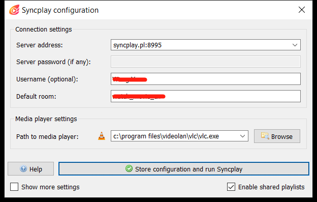
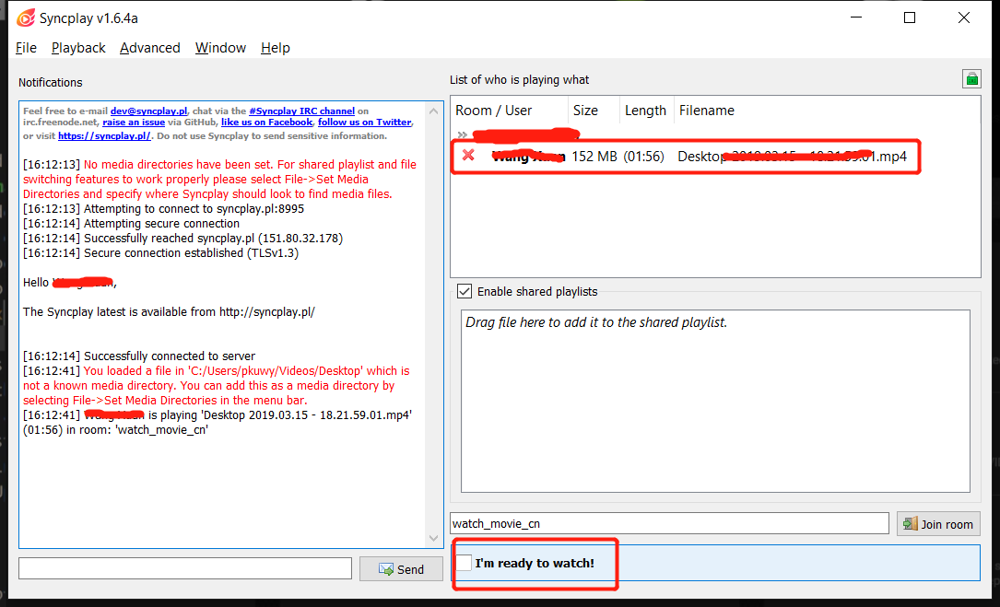

近日疫情致令本州下了居家令。不过在居家令之前，本也不敢出门了。线下社交完全停滞，就和朋友们约着在线上一起做些事情。比如线上的 movie night。今晚成功举行了第一次，大家聊得很开心。这里是一份实操指南。和我以前写的指南风格不同，为了将来邀请不那么懂技术的朋友一起看电影，会写得很详细。

在开始正文之前，先列举一下各种在线一起看电影的方法。大致来说，需要两种工具。一种用来同步所有人的播放进度条，方便有人去喝水上厕所时大家聊天等待。另一种用于语音聊天。后者没什么可说的，前者才是难点，可惜并没有什么可以通吃所有视频的方案。

- 对于 Netflix、Youtube、Amazon Prime 乃至优酷、爱奇艺、B站等国内视频网站，有许多浏览器插件可以用于同步播放进度。
- 对于本地文件，有两种方案
  - 一种是我们今天晚上所采用的，每个人在各自电脑上播放视频，使用软件同步播放进度。这是今天的主题
  - 一种是由一个人设置 video streaming server，其它人连上去观看。以前常用 Winamp、foobar2000 来开设或收听 [ShoutCast](https://www.shoutcast.com/) 网络电台的人对此一定不会陌生。就是在网络电台中播放视频罢了。如何使用 [VLC](https://www.videolan.org/vlc/index.html) 来开设“网络电视台”我会[另文](https://blog.wangxuan.name/2020/03/31/how-to-use-vlc-stream-video/)详述。[Plex](https://www.plex.tv/) 和 [Kodi](https://kodi.tv/) 也可以用来这么干，但是这些 Media Center PC 的解决方案未免太重型了。
- 还有的观影 app 或者服务本身支持多人一起在线观看电影。有些已经死了，现在有一个叫 [微光](https://www.vlightv.com/) 的 app 还活着。倒是“虚拟电影院”类的 VR 软件颇为不少，有 VR 头显的人可以试试。

有一篇不错的 [英文文章](https://www.techworm.net/2020/01/watch-videos-together-with-friends.html) 总结了各种工具。其中对于中文互联网常见工具欠奉。比如说，有一个叫 [Coplay](https://github.com/Justineo/coplay) 的 Firefox/Chrome 插件支持常见的国内视频网站。

好了，开始正题。[SyncPlay](https://syncplay.pl/) 是一个跨平台的用于同步各自电脑上视频播放进度的开源软件。支持 Windows Mac Linux \*BSD。

使用 [SyncPlay](https://syncplay.pl/) 来一起看电影的话，需要如下条件。如果不能满足的话，或应考虑换别的方法一起看电影

- 将待播放的视频文件预先分发给每一个人。在海外 DropBox 的速度相当不错，国内就得另想办法了。
- 在每个人的电脑上安装 [SyncPlay](https://syncplay.pl/) （不想安装可以用绿色版）
- 保证每个人的电脑上有至少一个 [SyncPlay](https://syncplay.pl/) 支持的视频播放器，比如说 [VLC](https://www.videolan.org/vlc/index.html)、MPC、[mpv](https://mpv.io/)。没有的话需要装一个。
- 准备一个用于语音聊天的平台，用电话、微信、QQ 还是 Skype、Zoom 都无所谓。就我有限的体验来看，似乎跨国视频还是 Zoom 最流畅。
- 最后是一句废话：需要有一台能上网的电脑。但对网速没有要求

作为最佳实践，在观影活动开始之前，多人观影活动的主持者需要做如下事情

- 用 Google Docs 或者类似的在线文档平台创建一个公告板，用于汇总本次观影活动的信息。微信群聊的大水很容易淹没通知信息，所以需要一个专门的公告板
- 将视频文件上传到一个网盘上
- 在公告板上列出如下信息
  - 放映活动的时间
  - 视频文件的下载地址
  - [SyncPlay](https://syncplay.pl/) 的服务器地址和房间名称。  
    如果不打算自建服务器的话，可以使用 [SyncPlay](https://syncplay.pl/) 官方提供的四个服务器地址。需要详细到端口号（不同端口是不同的服务器）。房间名称可由活动组织者指定任意字词，只要大家都在一个服务器上的一个房间即可同步
  - 语音聊天所用的平台和加入的方法。  
    比如说使用 Zoom 的话可贴出 Zoom 链接
- 其它步骤与普通参与者相同

作为最佳实践，观影活动的参与者需要做的事情如下

1. 查看组织者所发布的活动公告，并下载视频文件
1. 如果希望自己晚到时别人等一下自己，可在公告板上留下自己的名字
2. 安装 [SyncPlay](https://syncplay.pl/) 和一个 [SyncPlay](https://syncplay.pl/) 所支持的视频播放器。如已安装可跳过此步
3. 在活动开始前几分钟，关闭电脑上的其它视频播放器窗口，打开 SyncPlay，在其界面中依次填写下列各项
    - Server address 填写活动公告给出的服务器地址
    - Default room 填写活动公告给出的房间名
    - Username 可不填，推荐填写一个方便别人认出自己的名字
    - 如果已经安装了支持的播放器，"Path to media player" 一项应该已经自动填好。如果安装了多个播放器，选一个自己喜欢的。  
   
4. 点击 "Store configuration and run SyncPlay" 按钮，会弹出一个视频播放器窗口。将准备一起看的视频文件拖入该视频播放器窗口中（而不是 SyncPlay 窗口中）。此时 SyncPlay 窗口右半边显示房间中已有的用户和每个用户播放器中的文件名。请保证自己的用户名后面显示了视频文件名，而非空白。如果不是这样，请重复第4步和第5步，可能是未关闭所有已有视频窗口。  
   
4. 连上语音/视频聊天平台，和所有人打个招呼
5. 人到齐之后，每个人都勾选 SyncPlay 窗口右下角的 "I'm ready to watch"。然后任意一个人点击视频播放器的播放按钮，所有人的视频就会同步开始播放。
5. 视频开始播放后，使用音箱的观众应将自己语音聊天的麦克风关闭，以免形成回声。使用耳机的用户不需要闭麦。觉得自己这边环境太吵的人也应当主动闭麦。
6. 如果使用 Zoom 群聊，将 Zoom 视频窗口最小化，它会自动生成一个悬浮窗。视频全屏播放时不会遮挡这个悬浮窗，方便在看电影时控制自己的麦克风。  
   如果麦克风常开，不需要 Zoom 悬浮窗，也不希望视频被 Zoom 的悬浮窗所遮挡，那么不要最小化 Zoom 窗口，直接让播放器全屏即可
7. 在开口说话之前，看一眼自己的麦克风是否已经关闭。如果关闭的话，先打开麦克风再讲话
8. 如果需要离开片刻，可以在剧情不紧张的时候按下暂停，和朋友们解释一下后离开。其它人的视频也会暂停，可以用这个时间讨论剧情或者闲聊。
  
观影活动结束后，建议主持者删除网盘上的视频文件，以保护自身隐私。

总体来说，[SyncPlay](https://syncplay.pl/) 这套方案优点很多

- 完美的跨平台支持，所有人都可以用
- 对网络条件要求很低
- 因为视频文件在本地播放，可以有很好的画质
- 非常稳定，很少出问题
- 开源软件，可以选择自建服务器，不用担心隐私泄露

但也有一些缺点

- 每个人都需要下载视频文件。这并不方便，也不总是可行。
- 需要安装 [SyncPlay](https://syncplay.pl/)，略麻烦了一点
- 语音群聊的时候使用音箱观影的人大部分时候需要闭麦
- 弹幕功能仅支持 mpv 播放器，所以主要还是和语音群聊搭配使用

**和朋友一起看电影系列**

[使用 SyncPlay 和异地朋友一起看电影](https://blog.wangxuan.name/2020/03/30/watch-movie-remotely-with-syncplay/)  
[使用 VLC 举办在线观影活动](https://blog.wangxuan.name/2020/03/31/how-to-use-vlc-stream-video/)
