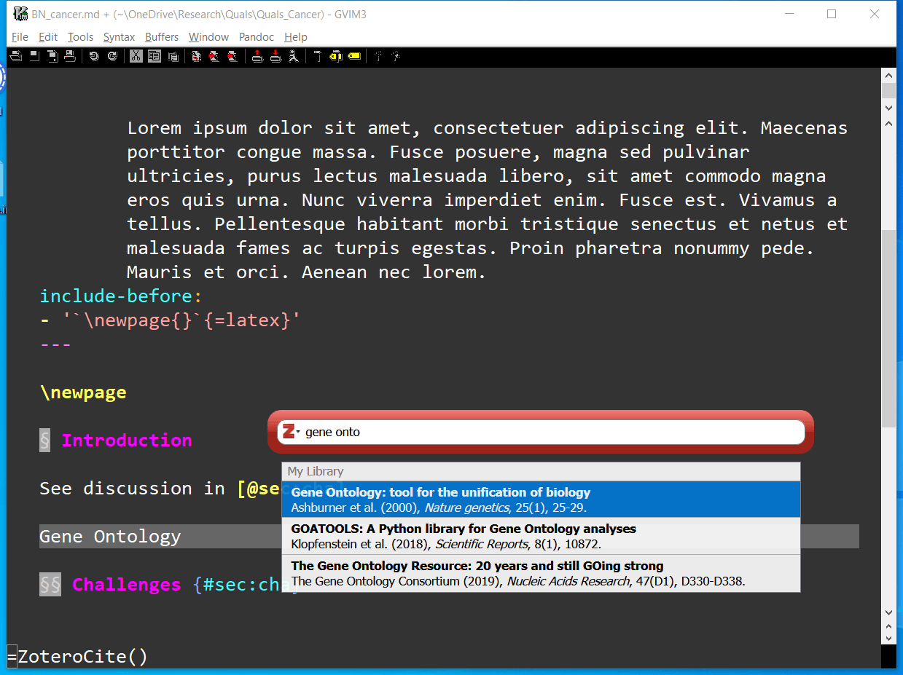
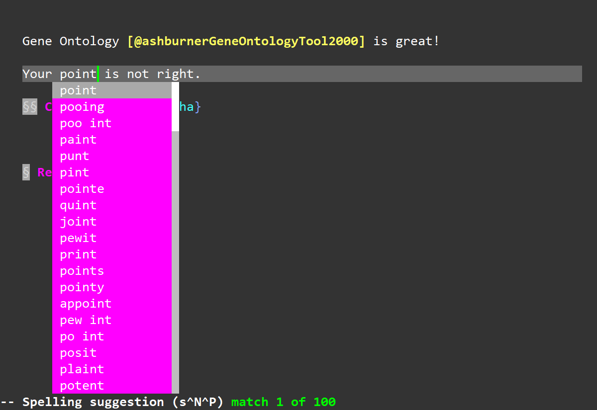
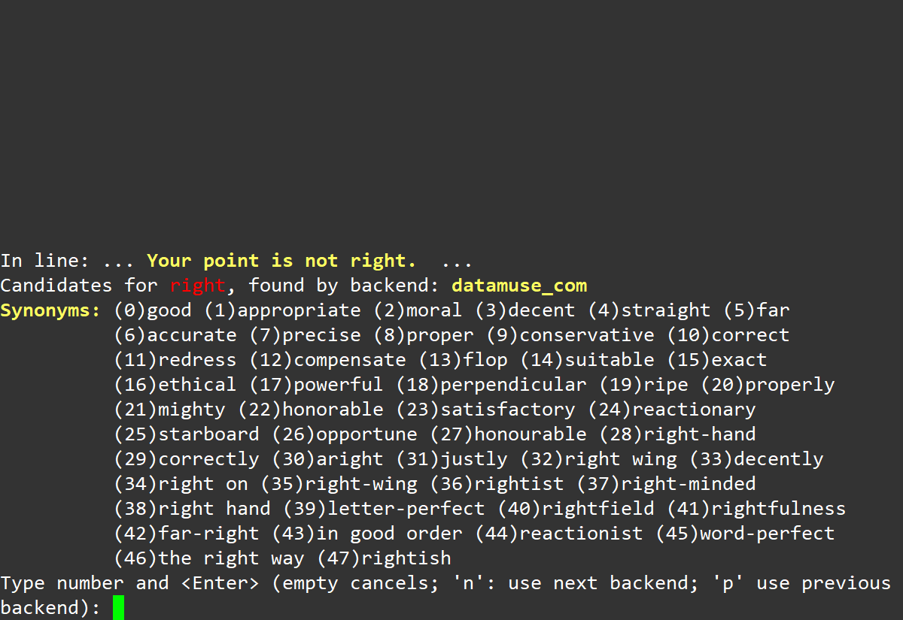
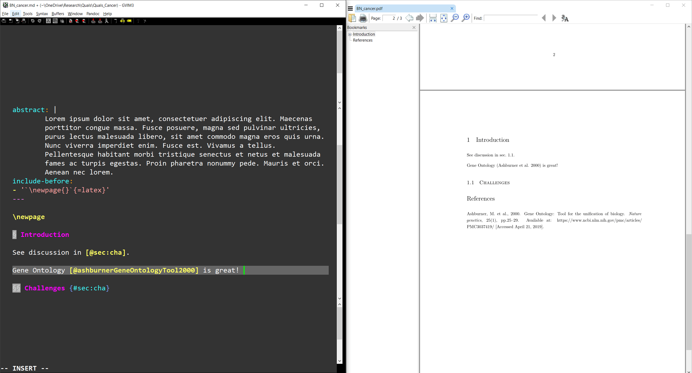
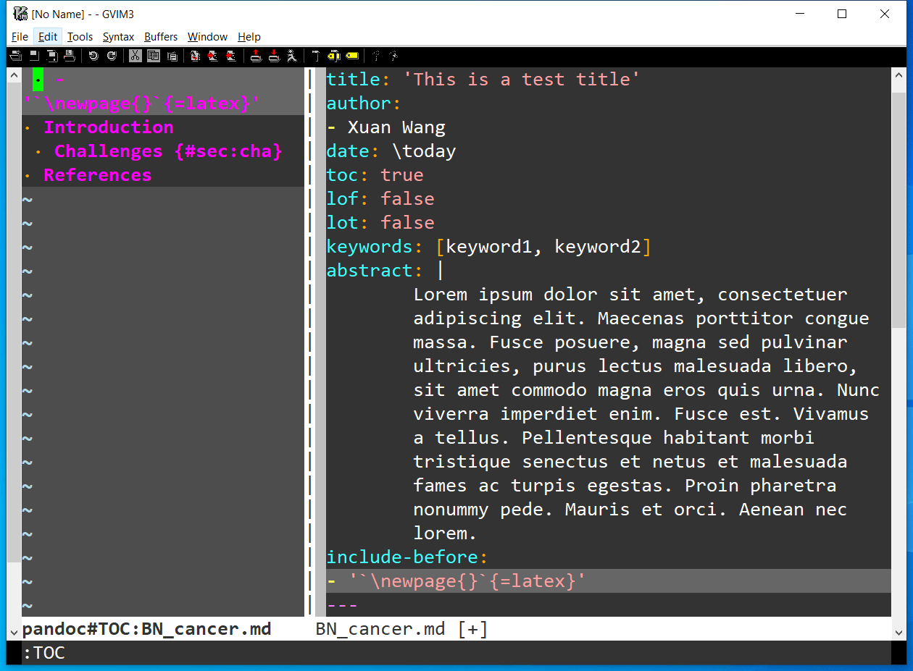

**概要**

相对于其它选择来说，markdown 格式方便人更专注于文章内容的写作。然而它用于写短文绰绰有余，论文排版则需要许多额外的功能。本文介绍了我使用 markdown 写论文的折腾过程，基本上扫清了论文写作中的常见需求：一键搜索并插入引用文献、文档内交叉引用、公式图表编号、LaTeX 输出与模板套用、Word 文档输出、一键后台编译多份文档、同义词查询、拼写语法检查等。

本文虽然主体已经完工，但可能不定期修改，以方便读者理解。如果觉得本文有用，欢迎收藏，并在写论文时回来看看有没有更新。

如有难以理解的部分，欢迎留言或者对[此文件](https://github.com/xuan-w/wp-blog/blob/master/_posts/2020/write-paper-markdown-vim.md)发 Pull Request。

下面是几个使用示例截屏：

一键搜索引用文献



拼写自动更正



同义词检索替换



编译预览结果



# 引言

去年这个时候我颇花了一点时间打造了一套 VIM 上使用 markdown 写论文的系统。现在我准备投靠 Emacs 和 org-mode，这套系统以后怕是不会再用了。在这里记下来我的配置，或许对于一些人会有用——毕竟 VIM 用户还是比 Emacs 用户多多了。而且这些的许多配置使用其它文本编辑器的人也可以借用。

## 为什么使用 markdown 写论文？

使用 markdown 的优点
:   markdown 是一种只保存必要文档结构，不保存格式和样式信息的文档格式，我们可以用同样一份 md 文档很方便地生成不同格式的最终文档。它语法简明，易读易写，作为纯文本文件，方便使用 git 进行版本控制。相较之下，其它的几种流行格式各有各的缺点

    - HTML 虽然可以将样式定义都放在 CSS 里，但是 HTML 本身手写起来麻烦且不易读。
    - Microsoft Word 当然在会用的人手里非常强大，也能实现结构和样式的分离，不过难以用 git 来进行版本控制。纯文本文件爱好者会不大喜欢这种格式。另外许多院系大部分教授偏爱 LaTeX 生成的 PDF 而不喜欢 Word。
    - LaTeX 作为理科学术界论文写作的事实标准已经有几十年。主要缺点是配置麻烦，不稳定，没有实现彻底的文档结构与样式的分离。这套老旧的系统已经背上了太多历史包袱。层层叠叠的复杂依赖关系令人望而生畏，初学者容易陷入各种配置问题或者受到上游包更新所引入 bug 的影响而捣腾半天编译不出来。幸而这些年有了 [Overleaf](https://www.overleaf.com/) 这样的在线编辑和编译平台，大大减少了普通用户的折腾程度。从 LaTeX 系统的发展史来说，TeX 本身是一套强大的排版语言，写作时需要将文档内容和排版指令混在一起，这当然非常麻烦，所以现在没人直接用 TeX 写东西了。LaTeX 这套宏包的出现才使得 LaTeX 系统看上去像是在使用和 HTML 相仿的标记语言，便利用户将文档结构和样式信息做分析，然而这种尝试并不彻底。而且相对于 markdown 的简洁来说，文档中留有大量哆嗦的“标记”，影响原始文档的阅读体验。


markdown 写论文的缺点
:   由于 markdown 最早只被设计了非常轻量的功能，各种扩展功能如表格、交叉引用、数学公式支持等均告厥如。后者不同人开发了不同的 markdown 扩展语法用于扩展 markdown 的功能。然而这些扩展也带来一些新的问题

    - 首当其冲的就是，不同人做的扩展的语法并不兼容。在最基本的 markdown 语法之外的其它语法如巴别塔一样混乱。这些不同的 markdown 语法被称为不同的 flavor。[CommonMark](https://commonmark.org/) 是一个现在采用比较广的标准，但它只是对于不同 flavor 所取的最大公约数，其功能是相当有限的。使用 CommonMark 之外的语法，就要冒着文档在某些平台上无法编译或者正确显示的风险。对此，我决定选用 [pandoc](https://pandoc.org/) 所支持的语法。连 pandoc 也不支持的写法，就要冒不小的将来无法编译的风险了，需要将最终结果转存为别的格式以防万一。
    - 第二个问题是，如果在 markdown 上扩展过多的新语法，同时又坚持 markdown 的设计原则——一切标记尽可能地简短不影响阅读，那么就不得不去记忆眼花缭乱的各种特殊符号的含义。这时 LaTeX 的各种宏虽然写起来冗长，反而易于长期维护。

## 系统简介

我的这套系统以 [pandoc](https://pandoc.org/) 作为核心，扩充 vanilla markdown 所不支持的各种高级功能。同时使用一系列 VIM 插件来改善在 VIM 上写论文的体验。我所使用的 VIM 插件，许多在 VSCode 之类的编辑器上也有功能相当的插件。

下面分为 markdown 扩展、VIM 写作环境和编译系统三部分来概括。

### markdown 扩展

- LaTeX 公式支持：pandoc 自带，需要安装 LaTeX
- 表格支持：pandoc 自带
- BibLaTeX 文献引用支持：pandoc-citeproc 插件（最新的 pandoc 已经自带）支持 markdown 插入引用。[Zotero](https://www.zotero.org/) 管理文献，Zotero 的 [Better BibTeX](https://retorque.re/zotero-better-bibtex/) 插件用于连接 Zotero 和 VIM、pandoc 编译系统。
- 标题、图表的编号和交叉引用：[pandoc-crossref](https://github.com/lierdakil/pandoc-crossref) 插件

### VIM 写作环境

- markdown 语法高亮和其它 pandoc 支持：VIM 插件 [vim-pandoc](https://github.com/vim-pandoc/vim-pandoc) [vim-pandoc-syntax](https://github.com/vim-pandoc/vim-pandoc-syntax)
- 一键插入引用：vimrc 里直接配置 Better BibTeX。其它文本编辑器也很容易设置
- 绘制表格：VIM 插件 [vim-table-mode](https://github.com/dhruvasagar/vim-table-mode)
- 同义词查询：VIM 插件 [thesaurus_query.vim](https://github.com/ron89/thesaurus_query.vim)
- 语法检查：VIM 插件 [vim-grammarous](https://github.com/rhysd/vim-grammarous)
- 无干扰写作：VIM 插件 [goyo](https://github.com/junegunn/goyo.vim)
- VIM 插件管理 [vim-plug](https://github.com/junegunn/vim-plug)

### 编译系统

- 使用 Makefile 管理文稿、图片与输出的最终 PDF 文件之间的更新关系。我使用 GNU make，因为微软的 nmake 功能实在有点少。
- 为了在 VIM 后台编译文档，使用 VIM 插件 [asyncrun.vim](https://github.com/skywind3000/asyncrun.vim)
- 使用 [Sumatra PDF](https://www.sumatrapdfreader.org/free-pdf-reader.html) 预览生成的 PDF，因为它轻量而且不会对 PDF 文件上锁，在 PDF 文件被更新之后可以实时更新预览

# 功能配置

## pandoc 安装与插件配置

[pandoc](https://pandoc.org/) 可以从官网直接下载安装。也可以使用系统的包管理器安装。Windows 用户也可以使用 [scoop](https://scoop.sh/) 这样的第三方包管理器。安装完成之后，为了调用方便起见，最好加到系统的 PATH 里。

pandoc-citeproc 在最新版的 pandoc 中已经自带，无需额外下载。pandoc 主体和 pandoc-citeproc 对于 markdown 语法的扩充详见[官方帮助](https://pandoc.org/MANUAL.html)。对于论文写作来说，特别需要的几点扩充分别是：[表格](https://pandoc.org/MANUAL.html#tables)，[脚注](https://pandoc.org/MANUAL.html#footnotes)、[数学公式](https://pandoc.org/MANUAL.html#math)和[引用文献格式](https://pandoc.org/MANUAL.html#citations)。这些都可以手写，但是许多文本编辑器都可以配置一些快捷键，就不用记忆和手敲这些东西，便捷程度接近 Word。尤其是引用文献，手写起来非常麻烦。在下一节会详细介绍我的配置。

pandoc 本身没有包含交叉引用的功能。[pandoc-crossref](https://github.com/lierdakil/pandoc-crossref) 这个 pandoc filter 可以实现这些功能。直接去它网页依说明下载安装即可。需要注意的是，如果下载已经编译好的版本，需要下载和自己的 pandoc 版本相对应的版本。有了这个插件就可以实现公式、图表、标题的交叉引用，还可以实现一个图表中插入多个子图。读者可自行参详其帮助。

如果需要使用 pandoc 生成 tex、PDF、Beamer 演示文稿，需要在系统中安装全套 LaTeX。我建议读者直接安装 [TeXLive](https://www.tug.org/texlive/) 发行版。不要安装2018版，2018版里有个 bug 需要升级一下或者手动修理。现在 2019 版还是比较稳定的。TeXLive 中带有很多 engine，我推荐使用 xelatex 作为 PDF 输出引擎，否则文档中有非拉丁字符的话容易出 bug。

具体的 pandoc 命令，可以参考下面章节中我的一键编译系统的 Makefile 中相应命令。

pandoc 编译生成 PDF 时可以套用各种 LaTeX 模板。我使用并修改了这位哥们的模板：[phd_thesis_markdown](https://github.com/tompollard/phd_thesis_markdown)

## 设置 Zotero 引用文献

[Zotero](https://www.zotero.org/) 用于管理参考文献非常好用。使用别的文献管理软件的人，我就不知道怎么搞了。

Zotero 的 [Better BibTeX](https://retorque.re/zotero-better-bibtex/) 插件有很多非常有用的功能。在这些我们主要用到它的两个功能：

- 生成一个实时更新的 BibTeX 文件，这样在 LaTeX 或者 markdown 文档中就可以方便地引用。没有这个插件的话，每当 Zotero 中新加一篇参考文献，就得手工编辑一下 bib 文件，这就很麻烦。
- 在文本编辑器中一键呼出 Zotero 的检索条，输入搜索关键词之后直接插入 citation 到光标所在位置。

后者的效果已经在前文中展示过。


Better BibTex 的帮助中，对于如何在各种文本编辑器中设置一键搜索引用有详尽的说明，见[此链接](https://retorque.re/zotero-better-bibtex/citing/cayw/)。对于 VIM 来说，将此帮助中的代码插入 vimrc 即可。特别需要指出的是，Windows 用户需要安装 curl 才能让那段代码正常工作。我觉得用 [scoop](https://scoop.sh/) 安装 curl 会比较省心。

## 配置VIM 写作环境

这里主要介绍几个 VIM 插件的用途和配置方法。

### vim-pandoc

VIM 插件 [vim-pandoc](https://github.com/vim-pandoc/vim-pandoc) [vim-pandoc-syntax](https://github.com/vim-pandoc/vim-pandoc-syntax) 是一套比较好的支持 pandoc 扩展 markdown 语法的 VIM 插件。主要功能有：语法高亮、将公式上标下标直接以上下标字体显示在 VIM 中、一键编译（我自己是出于别的目的另配了编译系统）、目录、章节跳转、各种快捷键等。

如果没有安装 VIM python 支持的话，这两个插件只能使用一些基本功能。虽然说基本功能对于大多数用户也完全够用了。如果准备长期使用 pandoc 写作的话，建议安装 VIM 的 python 支持以使用这个插件的全部功能，增加工作效率。

VIM 的 python 支持安装起来非常麻烦。因为必须和编译 VIM 时所用的 python 版本完全一致。这就意味着往往需要在操作系统里已经装的 python 之外再安装一个低版本的 python。安装完之后再在 vimrc 里配置 `pythonthreehome` 和 `pythonthreedll` 两个变量。详见本文末尾我的 vimrc。如果中文互联网上没有好的介绍 VIM python 支持的文章的话，或许哪天我另写一篇。

下图显示了使用此插件查看论文大纲的样子：



### vim-table-mode

[vim-table-mode](https://github.com/dhruvasagar/vim-table-mode) 这个插件主要是为了解决在 markdown 中绘制表格特别麻烦的问题。Emacs 中有 table-mode 非常好用，所以有人写了一个 vim-table-mode。

使用起来非常简单，像 Emacs table-mode 一样，开启之后在一行开头输入 | 之后它就会自动排版和伸缩表格。这样的话，在 VIM 中画表格反而比在 Word 中还快。

### thesaurus_query.vim

[thesaurus_query.vim](https://github.com/ron89/thesaurus_query.vim) 是一个同义词查询插件。写英文论文的时候，同义词查询太重要了！有了这东西就再也不用搜索枯肠去想哪个词最贴切。有时候明明觉得有一个词适合用在此处，但是就是想不起来，翻汉英词典太慢，还经常查不着。这时候就可以直接先敲一个能想出来的小学英语级大俗词，然后检索一下同义词，从里面选一个即可。

效果如下图所示：


### Goyo

[goyo](https://github.com/junegunn/goyo.vim) 是一个让写作时排除干扰的插件，开启之后写作界面就特别清爽。

### 拼写语法检查

拼写检查是 VIM 自带的功能。在 vim-pandoc 中也是默认对正文开启而对代码区块关闭的。如果需要手工开启的话，输入 `:set spell` 命令即可。写东西时可以用 Ctrl-x s （先按下 Ctrl-x，再按下 s）来对上一个标红的单词进行更正，效果如下图。


语法检查就要麻烦一些。我用的是 [vim-grammarous](https://github.com/rhysd/vim-grammarous) 这个插件。它调用了 [LanguageTool](https://www.languagetool.org/) 来对文本进行语法检查。

[LanguageTool](https://www.languagetool.org/) 是许多开源 Office 类软件如 LibreOffice 中常用的语法检查器。使用 vim-grammarous 这个插件的话，不能使用 LanguageTool 的在线版，而需要安装它的开源本地版。安装 LanguageTool 需要先安装 Java 运行环境。

## 配置一键编译和预览

### Makefile 系统

使用 markdown 或者 LaTeX 写文章的好处之一就是，如果文章中的图表因为种种原因需要更新（比如说补充数据），不需要大费周章一个个重新拖到文档里，直接重新编译一下就好。我甚至让我的程序直接输出图表到我的文章目录下，运行完程序图表就自动更新。同样，我们也可以在多份文档，比如说幻灯片、海报、报告、期刊文章中使用同一组图片，而不需要把它们到处复制来复制去。

在这种情况下，使用 Makefile 来管理各种更新依赖关系就特别方便。无论是文稿本身、文稿中的图片、还是某个模板文件被修改，都可以触发重新编译。

在我的 Makefile 当中，我主要做了几件事：

- 定义了 bib 文件的路径、LaTeX模板、pandoc 编译选项等全局变量
- 定义了 tex、PDF、docx 等输出 target
- 文章、海报、幻灯片被统一管理起来

我的 Makefile 写的有些复杂，读者未必需要其中所有的功能。故而附在文章最末。

如果读者不会写 Makefile 的话，也可以不用 make，而直接使用 vim-pandoc 中提供的编译文档工具，或者手工编译。那样的话，编译命令未免有点长，还是写个脚本方便一点。

### LaTeX 模板

因为我这次并没有向期刊投稿的需求，所以就套用了一个非常普通的模板 [phd_thesis_markdown](https://github.com/tompollard/phd_thesis_markdown)。读者可以研究修改模板文件。

### 一键编译和预览

为了能够在 VIM 后台一键编译，我使用了 [asyncrun.vim](https://github.com/skywind3000/asyncrun.vim) 这个插件。配置一下，无论是运行 make 命令还是别的编译命令都很方便。读者可参考我的 vimrc。

预览 PDF 我用的是 Sumatra PDF，因为 Adobe PDF 会锁住 PDF 文件。用 Adobe PDF 打开的文件，其它程序无法修改，也就无法在预览的同时进行任何修改。Sumatra PDF 没有这个问题，PDF 文件被修改之后它会实时更新。效果如下图：


当然，我弄这一套，是因为那时候还没有 Windows 下比较好的 VIM markdown 预览插件。现在的话，读者可以考虑 [markdown-preview](https://github.com/iamcco/markdown-preview.nvim) 之类的插件。曾经这个插件是不支持 Windows 的。当然，这个插件预览的是 HTML，和 PDF 显示效果会有一点差异。

# 附录

对于以下附录，如果需要代码高亮的话，可查看 [GitHub 版本](https://github.com/xuan-w/wp-blog/blob/master/_posts/2020/write-paper-markdown-vim.md#%E9%99%84%E5%BD%95)

## 我的 vimrc 中相关设置

下面是我的 vimrc。vimrc 文件中双引号 `"` 起头的是注释

```vim
" 设置中文折行显示和 gq J 时不加空格, 其中 M 在新版 VIM 中已经默认有了
set formatoptions+=mM

" 设置 VIM 的 python 支持以启用一些 VIM 插件的全部功能。读者应自行修改路径
" 事实证明 VIM 非常聪明，能认反斜杠。路径字符串不要加引号，加了会出错！
set pythonthreehome=C:\tree\HighSmall\Python36-32
set pythonthreedll=C:\tree\HighSmall\Python36-32\python36.dll


" Zotero Better BibTex 设置
function! ZoteroCite()
  " pick a format based on the filetype (customize at will)
  let format = &filetype =~ '.*tex' ? 'citep' : 'pandoc'
  let api_call = 'http://localhost:23119/better-bibtex/cayw?format='.format.'&brackets=1'
  let ref = system('curl -s '.shellescape(api_call))
  return ref
endfunction

noremap <leader>z "=ZoteroCite()<CR>p
inoremap <C-z> <C-r>=ZoteroCite()<CR>

” 插件设置
call plug#begin()
Plug 'vim-pandoc/vim-pandoc-syntax', { 'for': 'markdown' }
Plug 'vim-pandoc/vim-pandoc', { 'for': 'markdown' }
Plug 'dhruvasagar/vim-table-mode', { 'for': 'markdown' }
Plug 'ron89/thesaurus_query.vim'
Plug 'rhysd/vim-grammarous'
Plug 'junegunn/goyo.vim'
Plug 'skywind3000/asyncrun.vim'
” 下面两个曾经对于 Windows 用户没用，所以注释掉了。现在新版据说 Windows 可用
" Plug 'iamcco/mathjax-support-for-mkdp', { 'for': 'markdown' }
" Plug 'iamcco/markdown-preview.vim', { 'for': 'markdown' }
call plug#end()

" 设置按 \ s 键自动更新文档并编译
noremap <Leader>s :update<CR>
au filetype pandoc au BufWritePost *.md :mks! |:AsyncRun make

" 设置引用文献库的位置，请自行修改
au filetype pandoc
    \ let g:pandoc#biblio#bibs = ['C:\abc\efg\BetterBib.bib']

```

## 我的 Makefile

### 变量定义

通用变量定义部分我是写到一个单独的文件，再 `include` 进来的。读者不一定需要这种写法。此外，其中的各种路径请读者修改为实际路径。

Makefile 文件中 `#` 开头的一行是注释

```make
# Here we set a variable to indicate we are using Windows
WINDOWS=1

# command to open pdf. If it is running, don't open again. Please change path
OPEN_PDF=powershell -c "if(-Not(Get-Process -Name SumatraPDF -ErrorAction SilentlyContinue)){ start C:\abc\def\SumatraPDF\SumatraPDF.exe $(DOCNAME).pdf}"

# command to open pdf in Linux. If it is running, don't open again.
# OPEN_PDF=if pgrep "pdf" >/dev/null; then pdfviewer $(DOCNAME).pdf&; fi

# location of bib file. Please change path
GLOBAL_BIBFILE=C:\abc\def\BetterBib.bib

# define python command and pandoc command, if they are not in path, specify them here
PY=python
PANDOC=pandoc
PANDOC_COMMON_OPT=-F pandoc-crossref --number-sections

# set bibtex option for pandoc
BIB_OPT=--bibliograph="$(GLOBAL_BIBFILE)"

# OS specific part

# for windows and nmake, use below
ifdef WINDOWS
# this is for non utf-8 terminal. Pandoc only work in utf-8
OS_OPTION=chcp.com 65001
# in case of MSYS make, del is not recognized
RM_CMD_HEAD=powershell -c "rm 
# define directory path
BASEDIR=.
RMTEX=powershell -c "rm tex2pdf* -r -fo"

else
# for *nix, use below
# no need to change code page
OS_OPTION=echo nothing
# since powershell need the double quote, have to add this too
# simple rm -f quote *.pdf cannot delete it
# add -f to omit error messages
RM_CMD_HEAD=bash -c "rm -f
BASEDIR=$(CURDIR)
RMTEX=rm -rf tex2pdf*
endif

# define image files path
IMAGEDIR=$(BASEDIR)/images

# define style files directory
# Pandoc can use both / and \ to find files, no need to change path separator
STYLEDIR=$(BASEDIR)/style
TEX_TEMPLATE=$(STYLEDIR)/template.tex
TEX_HEAD=$(STYLEDIR)/preamble.tex
HTML_TEMPLATE=$(STYLEDIR)/template.html
REF_STYLE=$(STYLEDIR)/ref_format.csl
BEAMER_HEAD=$(STYLEDIR)/preamble_beamer.tex

```

定义几个文档文件名（具体来说，可能会有海报、文章、报告等）

```make
DOCNAME=paper_name
DOCNAME2=slides_name
```

### 文章 PDF 输出

这是一个示例。读者如果没有拆分多个 Makefile 的话，可以去掉 dependency 中的 `make/target.mk`。

在这些指定了，如果 markdown 源文档、Makefile 本身、各种模板文件、图片附件目录产生改变的话，就重新编译文档。

```make
$(DOCNAME).pdf: $(DOCNAME).md makefile make/target.mk \
       $(STYLEDIR) $(TEX_HEAD) $(TEX_TEMPLATE) $(REF_STYLE) \
       $(IMAGEDIR)
	$(OS_OPTION)
	$(PANDOC) $(DOCNAME).md \
		-o $(DOCNAME).pdf \
		$(PANDOC_COMMON_OPT) \
		$(BIB_OPT) \
		-H "$(TEX_HEAD)" \
		--template="$(TEX_TEMPLATE)" \
		--csl="$(REF_STYLE)" \
		--pdf-engine=xelatex \
		--verbose
```

### 文章 tex 输出

这里我定义了两个 tex 输出，一个是完整版，可以用 latexmk 编译生成 PDF，一个是只包含文档主体，没有套用任何模板的 tex 文件，方便手工套用其它 LaTeX 模板。

```make
$(DOCNAME).tex: $(DOCNAME).md makefile make/target.mk 
	$(OS_OPTION)
	$(PANDOC) $(DOCNAME).md \
		-o $(DOCNAME).tex \
		$(PANDOC_COMMON_OPT) \
		--biblatex \
		--pdf-engine=xelatex \
		--verbose

$(DOCNAME)_full.tex: $(DOCNAME).md makefile make/target.mk \
	$(STYLEDIR) $(TEX_HEAD) $(TEX_TEMPLATE) $(REF_STYLE)
	$(OS_OPTION)
	$(PANDOC) $(DOCNAME).md -s \
		-o $(DOCNAME)_full.tex \
		$(PANDOC_COMMON_OPT) \
		$(BIB_OPT) \
		-H "$(TEX_HEAD)" \
		--template="$(TEX_TEMPLATE)" \
		--csl="$(REF_STYLE)" \
		--pdf-engine=xelatex \
		--verbose
```

### 文章 docx 和 HTML 输出

这两个没什么说的。就是发给不喜欢 LaTeX PDF的人看文章用的。

```make
$(DOCNAME).docx: $(DOCNAME).md makefile make/target.mk \
	$(IMAGEDIR)
	$(OS_OPTION)
	$(PANDOC) $(DOCNAME).md \
		-o $(DOCNAME).docx \
		$(PANDOC_COMMON_OPT) \
		$(BIB_OPT) \
		--verbose

$(DOCNAME).html: $(DOCNAME).md 
	$(OS_OPTION)
	$(PANDOC) $(DOCNAME).md -s \
		-o $(DOCNAME).html \
		$(PANDOC_COMMON_OPT) \
		$(BIB_OPT) \

```

### Beamer 幻灯片输出

```make
$(DOCNAME2).pdf: $(DOCNAME2).md makefile make/target.mk \
       $(STYLEDIR) $(REF_STYLE) \
       $(IMAGEDIR)
	$(OS_OPTION)
	$(PANDOC) $(DOCNAME2).md \
		-t beamer \
		-o $(DOCNAME2).pdf \
		$(PANDOC_COMMON_OPT) \
		$(BIB_OPT) \
		-H "$(BEAMER_HEAD)" \
		--csl="$(REF_STYLE)" \
		--pdf-engine=xelatex \
		--verbose
```

### 通用 target

这里设置了几个用于清理文件、编译全部文件之类的通用 PHONY 目标。其中 default 应该放在最前面，是执行 make 命令时希望默认执行的目标。因为我大部分时候并不需要编译 docx、html 之类的格式，默认目标我只设置了编译 PDF 并预览。

```make
default: $(DOCNAME).pdf
	$(OPEN_PDF)

all: $(DOCNAME).pdf $(DOCNAME).tex $(DOCNAME)_full.tex \
	$(DOCNAME).docx $(DOCNAME).html

help:
	@echo "make" to compile pdf and view it
	@echo "make all" to compile pdf, html, docx and tex
	@echo "make $(DOCNAME).tex" to get parital tex to paste to overleaf
	@echo "make $(DOCNAME)_full.tex" to get complete tex file
	@echo "make $(DOCNAME).docx" to get docx
	@echo "make $(DOCNAME).html" to get html
	@echo "make clean" to remove all output documents
	@echo "make help" to display this help


cleantex:
	$(RMTEX)


clean: cleantex
	$(RM_CMD_HEAD) *.pdf"
	$(RM_CMD_HEAD) *.tex"
	$(RM_CMD_HEAD) *.docx"
	$(RM_CMD_HEAD) *.html"
	

.PHONY: default all clean help cleantex 
```
