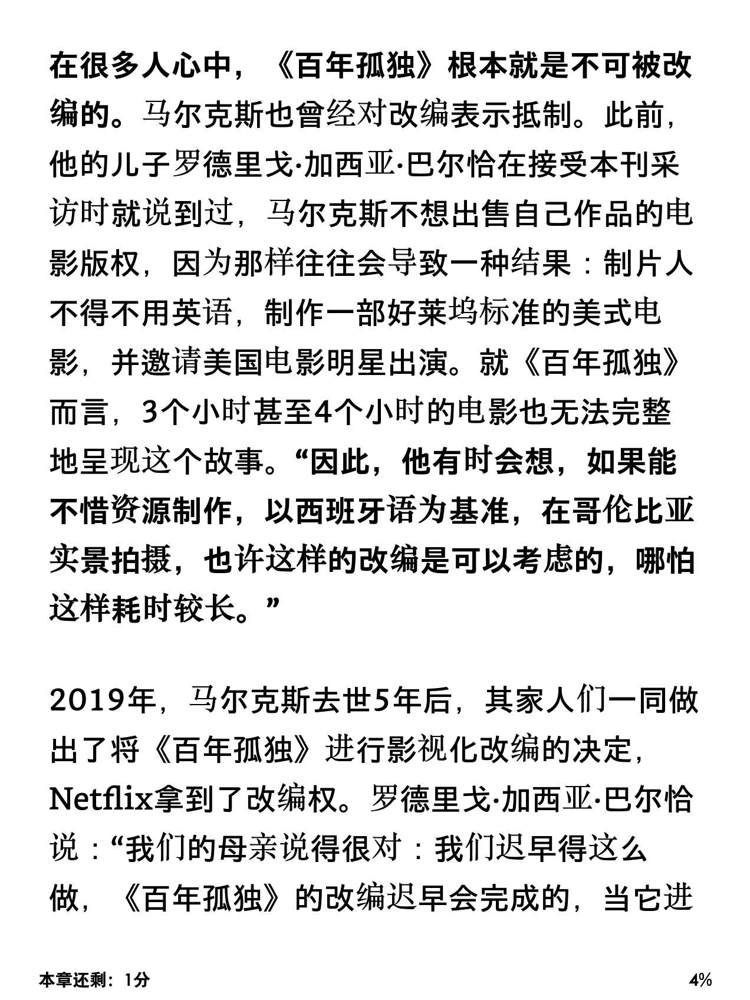

Update on Feb 28 2025: Kindle 新固件已经解决了字体设置不能持久生效的问题。中文显示问题比以前好解决了。

Update on Jan 06 2025: 在比较列表中增加了「简悦」。

Kindle 退出中国之后，国区的微信推送和 Send to Kindle 服务都结束运营。还能用的网页推送服务大多 bug 很多，好用的不多。在此列举并比较一些有代表性的服务。目前的现成服务都不完美，如果要满足各种要求，折腾是免不了的。

## 服务概览

目前，还能用的服务包括但不限于以下这些：

- [**Send to Kindle**](https://chromewebstore.google.com/detail/send-to-kindle-for-google/cgdjpilhipecahhcilnafpblkieebhea)：由 Amazon 官方提供的服务，现在一般使用美区 amazon 帐户进行推送。
- [简悦](https://github.com/Kenshin/simpread)：国人开发的「阅读模式」和「稍后读」插件。
- [**Pocket**](https://getpocket.com/)：Mozilla 旗下的热门「稍后读」服务。
- [**Instapaper**](https://www.instapaper.com/)：在 Kindle 还热门的时候一度很火的「稍后读」服务，曾经最大亮点是推送到 Kindle 上的文章合集非常精致。
- [**Wallabag**](https://doc.wallabag.org/user/configuration/rss/)：一个开源的「稍后读」服务，可以自己搭建服务器也可以使用官方服务。
- [**Calibre**](https://manual.calibre-ebook.com/news.html)：一款功能强大的电子书管理与转换工具，自带新闻抓取和邮件推送功能。
- [**微信读书**](https://weread.qq.com/): 如果要读微信公众号的话，可能是最方便的之一？也算是个歪门斜道的办法。
- Word 文档之类的奇技淫巧。

---

## 需要考虑的问题和可能遇到的毛病

找一个能用的服务不难，找一个好用的服务还真有点折腾。能不能抓到要看的网页，推送到 Kindle 上后看起来舒服不舒服，各各有些不同。

### 1. 需要登录才能访问的网页

某些网页内容（如付费新闻或社交媒体）需要登录后才能查看。这类内容通常需要通过浏览器插件直接抓取，而不能把一个链接发给服务器让服务器来抓。[^1]

大部分「稍后读」服务对此都或多或少有一些支持，但都需要 PC 端的 Chrome 或 Firefox 浏览器插件。在 iOS 设备上就比较挠头了。一般在 iOS Safari 上只能通过分享菜单把链接分享给对应 app，因此只能使用服务器端抓取。

目前支持浏览器抓取网页的服务及其插件表现：

- **Wallabag**：官方浏览器插件 Wallabagger 支持用户自定义要通过浏览器抓取的站点。
- **Send to Kindle**：全部通过浏览器抓取，但速度较慢。
- **简悦**：浏览器侧生成阅读模式后发送。
- **Instapaper**：似乎也支持浏览器直接抓取。
- **Pocket**：对部分网站（如《纽约时报》）有内置支持，但无法配置特定站点的浏览器抓取。对于不支持的网站就可能报服务器抓取失败。


### 2. 中文字符显示问题

这是一个 amazon 在 send to kindle 服务上取消 mobi 文件格式支持之后的新问题。由于这个问题出现的时候 amazon 已经官宣退出中国，对这个问题的讨论比较少。

现在用 send to kindle 服务的话，只能选择 epub 格式。而几乎所有服务推送的 epub 文件都把语言设置为英文。英文 epub 文件在转换并推送到 Kindle 上之后会出现诡异的中文字体问题，具体表现为：一部分中文字符是宋体，另一部分中文字符是黑体。与此同时，字体设置菜单只有英文字体可选，无法选择任何一款中文字体。仔细看的话，凡是日语中有的字符都是黑体，日语中没有的字符都是宋体，一看就是 fallback 时日文落在中文前面的老问题。Zotero 上也会有类似问题，在[之前的文章](https://blog.wangxuan.name/2016/03/07/solution-zotero-chinese-font-display-in-english/)中有过讨论。不知道为什么，原来 mobi 格式的文件就没有这个问题，也许那时候正好中文日文的默认字体都是宋体。



可惜 Kindle 是个封闭系统，没有办法设置文字 fallback 的顺序。一种解决办法是手动安装一个支持 CJK 字符的字体，比如说 [Noto Sans CJK](https://github.com/notofonts/noto-cjk) （如果只看中文，安装 [Noto Sans SC](https://fonts.google.com/noto/specimen/Noto+Sans+SC) 就够了）。字体的安装比较简单，直接拷到 fonts 目录下就可以。

~~折磨人的点在什么地方呢？不知道是目前 Kindle 系统的 bug 还是怎么回事，每次打开文件的时候，都得重新设置一遍字体！甚至退出到主页、打开一下浏览器都会重设字体。实在是有点不能忍~~

**更新：在 Kindle 系统升级到 5.17.1.0.4 之后，这个 bug 已经消失。原 bug 发生于 5.17.1.0 固件。**

> 如果不想折腾中文推送的话，现在可以通过安装支持中文显示的字体并保存一个新主题来部分解决这个问题。这样做之后，体验可以接近 KOReader。对于读所有书都喜欢用同一套字体的人来说，设置之后就基本无感了。对于英文中文书习惯用不同字体的人来说，会多一点切换字体主题的麻烦——因为这些推送来的网页声称自己是英文，调用专门设置的外置中文字体之后，再切换到其它英文读物时仍然会使用这套中文字体，就得再切一下主题才能切回喜欢的英文字体。KOReader 比 Kindle 好的点在于，KOReader 默认记忆这本书的主题设置，而不像 Kindle 的主题是全局生效。

> 由于下面为推送服务正确配置语言的办法大多比较折腾，如果读者对此要求不高，语言问题可以不用考虑，只考虑网页推送服务的抓取质量和阅读体验即可。

以下所有服务，统统都有这个语言设置错误的毛病：

- **Send to Kindle** （美区）
- **Pocket** （使用 Pocket to Kindle 服务）
- **Instapaper** （使用自带 Kindle 推送）
- **Wallabag** （直接导出 epub 的语言也是英语）

一劳永逸的解决方案有点折腾。有两个思路：

一个思路是，如果能用某种办法拿到生成的 epub 文件，修改语言不就是小菜一碟了吗？Wallabag 可以用 API 拿到每篇文章导出的 epub，Pocket to Kindle 的付费版可以发送到 kindle.com 之外的邮箱，同样有自行处理的余地，而 Pocket to Kindle 免费版和 Instapaper 只能发送到 kindle.com 邮箱，没有办法拿到他们生成的 epub 并做修改。

另一个办法就是用 Calibre 来抓取 Pocket 或者 Instapaper 的文章，然后再发送到 Kindle。在 Calibre 抓取的时候，可以轻松设置 epub 文件的语言。

无论是用什么办法，要想自动推送而不是手动抓，都得整个自己的服务器来定时抓取，设置好语言，再推送。对于不擅长技术的网友可能有些过于折腾。如果愿意把 Calibre 一直挂机的话，Calibre GUI 的配置倒是不麻烦。

### 3. 单篇网页，还是文章合集

最后一个问题是：Send to Kindle 这样的服务只能把单篇网页作为一本书推到 Kindle 上。要看的网页一多，就很乱。如果能推送文章合集的话，就会好很多。

---

## 具体服务比较

现在来看每个服务的问题在哪里。

### **Send to Kindle**

这个 Amazon 提供的官方服务可以说是一切 Kindle 推送的基础。不过这里我们主要关心的是网页推送的能力。在 Chrome 浏览器上有插件可以推送网页，在手机端则是分享给 Kindle app，但是在手机端无法实现浏览器端抓取。

它既不支持文章打包，又有中文显示问题，还不支持 Firefox。除了偶尔推个长篇英文文章（比如说论文）可以凑合一用，我实在想不出有什么理由用 Amazon 自家的浏览器插件。

### **简悦**

在写完本文之后才发现了「[简悦](http://ksria.com/simpread/)」这个服务。试了一下，它推送的文章无论中英文显示都是正确的。如果不想自己折腾而只想用成品服务的话，它是我所知的唯一可以正确处理中文的服务。

和别家不同，「简悦」在推送单篇网页的时候使用的是单文件 HTML 格式。

简悦服务有几个小缺点

- 需要付费版才能推送 Kindle。但相对于 Pocket to Kindle 和 Instapaper 的订阅价，简悦的买断价可以说非常便宜。
- 不能仅用简悦的浏览器插件进行推送，还必须安装「简悦・同步助手」才能实现邮件推送。购买配置较为繁琐。如果只是为了 Kindle 推送的话，略有些折腾。
- 推送也不是点一下插件图标，而是需要先进入简悦的阅读模式，再在二级菜单中选择推送到 Kindle。在推送之前必须先将阅读模式的主题设为浅色模式。如果阅读模式是深色，推送到 Kindle 的文章也是黑底白字。即使用键盘快捷键，也需要两次击键，两次点击，一次滚动，外加鼠标移动大半个屏幕的距离才能完成推送操作。
- 似乎只有单篇网页推送，没有「稍后读」合集推送。

这些小毛病单拎出来都没什么，集合在一起就让人觉得用起来很不方便。

### **Pocket**

如前述，现在它是 Mozilla 旗下，Firefox 原生集成，各平台都有 app 支持。

不打算自己折腾 Calibre 的话，第三方服务「Pocket to Kindle」可能是目前唯一的 Kindle 推送方案。这个服务如前所述，也有中文显示问题。

除了中文显示这个致命问题，还有一些小毛病：

- 如果免费版功能不敷使用，要买高级会员的话，Pocket 高级版 $5/月，Pocket to Kindle $3/月。Pocket to Kindle 免费版每周仅可推送 5 次，对于高频使用者不太够用。但反正中文显示是个不堪用的状态，讨论一个不能用的服务的缺点也没什么意义。
- 部分网页不能从浏览器端抓取，导致抓不到。

总之，如果很喜欢 Pocket 的跨平台支持，可以考虑用 Calibre 折腾一把。不然用起来很闹心。

### **Instapaper**

虽然功能多年没有大的更新，仍然是个很好用也很有特色的「稍后读」平台。曾经很漂亮的排版在 amazon 停止 mobi 推送之后泯然众人矣。但相对于 Pocket to Kindle 免费版的每周五次的限额，Instapaper 的 Kindle 推送不限次数，依然领先同行。如果想买会员的话，每个月是 $6 。

可惜，Instapaper 也有中文显示问题，对于中文用户来说也属于不能用的状态。如果只有看英文网页的需求的话，Instapaper 是个不错的选择，比 Pocket 方案要划算。

对于中文用户，还是得用 Calibre 来折腾一把。

### **Wallabag**

Wallabag 的浏览器插件是本文涉及的各种「稍后读」中最好用的。但它的移动端 app 有点寒碜。

在推送 Kindle 这件事上，它既不自带，也没有免费可用的第三方服务，全得靠自己折腾。

目前有两种折腾路线。

一种是使用 wallabag API 或者 python 包 wallabag-client 将其中的文章导出为 epub，再将 epub 文件中的 `<dc:language>en</dc:language>` 一行替换为 `<dc:language>zh</dc:language>`。最后再邮件发送到 Kindle。这个路线不太折腾，但是只能推送单篇文章，如果要推送文章合集的话，反而是 Calibre 方案更省力。

另一种办法是使用 Calibre 抓取 wallabag 的 RSS Feed 并推送文章合集。

如果不限于 Amazon 系统的话，可以给 Kindle 越狱装上 [KOReader](https://koreader.rocks/)。KOReader 自带一个 wallabag 插件，还有人写了一个据说在 wallabag 里文章很多的时候[性能更好的插件](https://github.com/clach04/wallabag2.koplugin)。KOReader 里的字体设置比 Kindle 自带系统细致得多，不需要设置文档语言也能调出可用的字体组合。

### **Calibre**

Calibre 差不多算是 Kindle 用户必备软件了。它有一个很有用的 fetch news 功能，可以用来抓 RSS 订阅、新闻报纸和各种网站更新。它也支持把抓取后的 epub 文件邮件推送到 Kindle 上。

Calibre 里用来定义如何抓取新闻源的文件叫 recipe，如果用 Calibre 来抓取 wallabag/Pocket/Instapaper 的话，只需要选用合适的 recipe 之后，在 recipe 的 class 里设置好变量 `language = 'zh'` 就可以解决中文显示问题（当然此时英文会有一些小问题，但 Kindle 黑体下的英文还能看）。

如果有时间的话，也许会再写一篇详细介绍一下如何配置。

Wallabag 没有官方 recipe 但可以在[配置 RSS](https://doc.wallabag.org/user/configuration/rss/) 之后直接抓取。Instapaper 和 Pocket 都有官方 recipe，可以直接使用。不过我更喜欢[另一个 Pocket recipe](https://github.com/mmagnus/Pocket-Plus-Calibre-Plugin)。

由于 Pocket 的 API 不提供 Pocket 处理好的网页，只提供原始网页链接，Calibre 再去抓取网页做成 epub，会常常遇到被服务器拒绝抓取、抓取图片失败、版式错乱等问题。而 wallabag 的 RSS 是全文 RSS。因此 calibre 配合 wallabag 的使用体验要好于配合 Pocket 使用。

如果使用 Calibre GUI 的话，直接在 Fetch News 按钮下面[配置](https://manual.calibre-ebook.com/news.html "calibre manual about how to add news source")就可以了。如果使用 Calibre 的命令行工具 `ebook-convert` 的话，可以写一个简单的脚本来定时抓取并发送邮件。

这样折腾的话有几个小缺点

1. 如果要实现定时推送，要么有个电脑一直在运行 Calibre，要么找个服务器定时运行脚本。
2. 需要自己写三五行代码来实现「如果没有新文章就不推送」的功能。而这个功能在 Pocket to Kindle 和 Instapaper 里都有。
3. Pocket to Kindle 和 Instapaper 的官方推送在每篇文章前后都有 archive/favorite 按钮，而 calibre 生成的 epub 文件里没有这些功能，无法在读完之后标记「已读」。实现这个功能需要自己搭个中转服务器大大折腾一番。

对于第一点，其实也可以用免费的 GitHub Action 来部署。[Calibre News Delivery](https://github.com/bookfere/Calibre-News-Delivery) 是一个已经做好的模板，直接部署并选择 recipe 后即可使用。作者也发布了一个[教程](https://bookfere.com/post/1107.html)。

对于第二点，如果你使用[这个 Pocket recipe](https://github.com/mmagnus/Pocket-Plus-Calibre-Plugin) 的话，可以参见附录我的代码。其它的 recipe 也可以参考这个思路。

最后一点确实有些折腾，如果觉得不太影响使用的话，可以不折腾。

### 微信读书等其它奇技淫巧

微信读书虽然不支持 Kindle 推送，但可以在 Kindle 上直接用浏览器打开 r.qq.com 来阅读，体验相当可以。而微信公众号直接在分享菜单里给微信读书留了一个位置。如果只是想看微信公众号的话，也许是最不折腾的方案。

另一个奇技淫巧是，把网页分享到手机上的 WPS，保存为 docx 文档之后再邮件发送给 Kindle。只要 WPS 里别点什么奇怪的配置，生成的 docx 文档的语言肯定是中文，也就不会有中文显示问题。但这个方法只适用于单篇文章，而且操作也有点太麻烦了。原则上手机上的 Office 也可以这么干，但是不知道为什么我手机上的 Office 总是顽固地试图分享 OneDrive 链接而不是实际的文档，不知道是不是我没找到路。

## 总结

综上，总结如下表。其中的「阅读模式」指的是，这些工具清理原网页的广告等干扰元素生成一个干净的「阅读视图」的能力。中文支持指的是推送到 Kindle 上的中文显示是否正常。

| 服务           | 浏览器抓取 | 文章合集     | 单篇文章 | 阅读模式 | 中文支持 |
|----------------|------------|--------------|----------|----------|----------|
| Send to Kindle | 是         | 无           | 是       | 一般     | 有问题   |
| 简悦           | 是         | 无           | 是       | 良好     | 优秀     |
| Pocket         | 部分       | 通过 P2K     | 通过 P2K | 尚可     | 有问题   |
| Instapaper     | 是         | 是           | 可       | 优秀     | 有问题   |
| Wallabag       | 是         | 通过 Calibre | 可 DIY   | 一般     | 可折腾   |
| Calibre        | -          | 是           | 可       | 不好     | 良好     |
| 微信读书       | -          | -            | 是       | -        | 优秀     |
| WPS            | -          | -            | 是       | 差       | 良好     |

为 Kindle 越狱后装上 KOReader 的方案不算在上表中，因为所谓「中文支持」问题，仅仅是 Amazon 原生系统才有的问题。KOReader 支持 wallabag 同步和 calibre 无线同步。


最后我的推荐是：

- 如果只看英文网页，推荐 Instapaper。
- 如果有中文需求的话
  - 如果能接受安装一款新字体来解决中文显示问题，不折腾语言匹配的话，仍然推荐 Instapaper。
  - 如果对字体和操作便利性都比较挑剔的话
    - 怕折腾但很少有把网页推送到 Kindle 的需求，可以考虑微信读书或者 docx 这类奇技淫巧。
    - 能折腾的话，推荐 Calibre 配合 Wallabag。如果已经用惯了 Pocket 或者 Instapaper 懒得迁移数据，也可以考虑用 Calibre 配合它们使用，效果没有 wallabag 好。
    - 如果只用单篇网页推送的话，「简悦」也是一个方案。
    - 既不能折腾又有很多中文网页阅读需求，恐怕没有什么好办法了。


## 附录

### 参考

写作本文时，除正文中已经给出链接的引用外，还参考了以下资料：

[为什么 Kindle 调用的字体和电子书语言不匹配](https://bookfere.com/post/433.html)

[用 GitHub Actions 让 Calibre 定时推送新闻到 Kindle](https://bookfere.com/post/1107.html)

[I wrote a script that automatically sends unread wallabag articles to Kindle](https://www.reddit.com/r/selfhosted/comments/zv0zyi/i_wrote_a_script_that_automatically_sends_unread/)

[https://www.xiaohongshu.com/explore/66bada96000000000d03300e](https://www.xiaohongshu.com/explore/66bada96000000000d03300e) （由于小红书的限制，必须在手机端打开此链接并跳转「小红书」 app 才可以查看内容）

### 修改 Pocket-Plus-Calibre-Plugin 使得无新文章则不推送

下面第一个 try 块是原 recipe 里本来就有的。搜索并找到之后将后面的代码粘进去就可以实现无新文章则不推送。别忘了定义 `SESSION_DATA_DIR` 变量并指向一个目录。

```python
                try:
                    response = self.browser.open(request)
                    response = json.load(response)
                except HTTPError as e:
                    if e.code == 401:
                        # Calibre access has been removed
                        self.reauthorize()
                        raise e

                all_item_id = set()
                for item in dict(response['list']):
                    all_item_id.add(str(response['list'][item]['resolved_id']))
                # compare with previous saved ids
                if path.exists(path.join(SESSION_DATA_DIR,'pocket_ids.txt')):
                    with open(path.join(SESSION_DATA_DIR,'pocket_ids.txt')) as f:
                        # read in old_item_id
                        old_item_id = set(f.read().splitlines())
                else: 
                    old_item_id = set()

                # compare new and old
                if old_item_id != all_item_id:
                    with open(path.join(SESSION_DATA_DIR,'pocket_ids.txt'), 'w') as f:
                        f.write('\n'.join(all_item_id))
                else:
                    self.abort_recipe_processing('No new articles in the Pocket account "{}"'.format(self.config.user))
```

### 我的定时发送 Pocket 文章到 Kindle 的脚本

这个脚本我加到 cron 里了。

```bash
#!/bin/bash

echo "----------------------"
echo "Start fetching Pocket"

date

cd /path/to/your/pocket/data

# name the epub with date and time (to seconds)
EPUB_FILE_NAME=pocket_$(date +"%Y-%m-%d_%H-%M-%S").epub

# generate the epub
ebook-convert Pocket.recipe $EPUB_FILE_NAME

# if file exists
if [ -f $EPUB_FILE_NAME ]; then
    # send the file to kindle
    calibre-smtp -e SSL -u username -p password -r email.server.domain --port 465 --attachment $EPUB_FILE_NAME --subject "Pocket" "your_email_address" "your_own@kindle.com" "Pocket unread, fetched on $(date +"%Y-%m-%d %H:%M:%S")"
fi

echo "End fetching Pocket"
echo "----------------------"
```

[^1]: 这里的「服务器抓取」指的是把网页链接发送给某个在线服务，让它的服务器去访问和提取网页内容。但这种方法的问题是，「稍后读」服务器那边并没有你的登录信息，无法登录并查看这些需要登录才能查看的页面。与此相反，「浏览器抓取」方法是在你本地浏览器已经登录并有权限的情况下进行，直接把你正在查看的网页内容发给「稍后读」服务。
